<h1>Table of Contents<span class="tocSkip"></span></h1>
<div class="toc"><ul class="toc-item"><li><span><a href="#Human-Activity-Recognition-using-Smartphones" data-toc-modified-id="Human-Activity-Recognition-using-Smartphones-1">Human Activity Recognition using Smartphones</a></span></li><li><span><a href="#Data-and-Problem-Statement" data-toc-modified-id="Data-and-Problem-Statement-2">Data and Problem Statement</a></span><ul class="toc-item"><li><span><a href="#How-data-was-recorded" data-toc-modified-id="How-data-was-recorded-2.1">How data was recorded</a></span><ul class="toc-item"><li><span><a href="#Feature-names" data-toc-modified-id="Feature-names-2.1.1">Feature names</a></span></li><li><span><a href="#Y_Labels(Encoded)" data-toc-modified-id="Y_Labels(Encoded)-2.1.2">Y_Labels(Encoded)</a></span></li></ul></li><li><span><a href="#Train-and-test-data-were-saperated" data-toc-modified-id="Train-and-test-data-were-saperated-2.2">Train and test data were saperated</a></span></li><li><span><a href="#Quick-overview-of-the-dataset-:" data-toc-modified-id="Quick-overview-of-the-dataset-:-2.3">Quick overview of the dataset :</a></span></li><li><span><a href="#Problem-Framework" data-toc-modified-id="Problem-Framework-2.4">Problem Framework</a></span></li><li><span><a href="#Problem-Statement" data-toc-modified-id="Problem-Statement-2.5">Problem Statement</a></span></li></ul></li><li><span><a href="#Loading-Data" data-toc-modified-id="Loading-Data-3">Loading Data</a></span><ul class="toc-item"><li><span><a href="#Obtain-the--train-data" data-toc-modified-id="Obtain-the--train-data-3.1">Obtain the  train data</a></span></li><li><span><a href="#Obtain-the--test-data" data-toc-modified-id="Obtain-the--test-data-3.2">Obtain the  test data</a></span></li></ul></li><li><span><a href="#Data-Cleaning" data-toc-modified-id="Data-Cleaning-4">Data Cleaning</a></span><ul class="toc-item"><li><span><a href="#1.-Check-for-Duplicates" data-toc-modified-id="1.-Check-for-Duplicates-4.1">1. Check for Duplicates</a></span></li><li><span><a href="#2.-Checking-for-NaN/null-values" data-toc-modified-id="2.-Checking-for-NaN/null-values-4.2">2. Checking for NaN/null values</a></span></li><li><span><a href="#3.-Check-for-data-imbalance" data-toc-modified-id="3.-Check-for-data-imbalance-4.3">3. Check for data imbalance</a></span><ul class="toc-item"><li><span><a href="#Observation" data-toc-modified-id="Observation-4.3.1">Observation</a></span></li></ul></li><li><span><a href="#4.-Changing-feature-names" data-toc-modified-id="4.-Changing-feature-names-4.4">4. Changing feature names</a></span></li><li><span><a href="#5.-Save-this-dataframe-in-a-csv-files" data-toc-modified-id="5.-Save-this-dataframe-in-a-csv-files-4.5">5. Save this dataframe in a csv files</a></span></li></ul></li><li><span><a href="#Exploratory-Data-Analysis" data-toc-modified-id="Exploratory-Data-Analysis-5">Exploratory Data Analysis</a></span><ul class="toc-item"><li><ul class="toc-item"><li><span><a href="#1.-Featuring-Engineering-from-Domain-Knowledge" data-toc-modified-id="1.-Featuring-Engineering-from-Domain-Knowledge-5.0.1">1. Featuring Engineering from Domain Knowledge</a></span></li><li><span><a href="#2.-Stationary-and-Moving-activities-are-completely-different" data-toc-modified-id="2.-Stationary-and-Moving-activities-are-completely-different-5.0.2">2. Stationary and Moving activities are completely different</a></span></li><li><span><a href="#3.-Magnitude-of-an-acceleration-can-saperate-it-well" data-toc-modified-id="3.-Magnitude-of-an-acceleration-can-saperate-it-well-5.0.3">3. Magnitude of an acceleration can saperate it well</a></span></li><li><span><a href="#4.-Position-of-GravityAccelerationComponants-also-matters" data-toc-modified-id="4.-Position-of-GravityAccelerationComponants-also-matters-5.0.4">4. Position of GravityAccelerationComponants also matters</a></span></li></ul></li></ul></li><li><span><a href="#T-SNE-visualisation-of-data" data-toc-modified-id="T-SNE-visualisation-of-data-6">T-SNE visualisation of data</a></span><ul class="toc-item"><li><ul class="toc-item"><li><span><a href="#Observation-:" data-toc-modified-id="Observation-:-6.0.1">Observation :</a></span></li></ul></li></ul></li><li><span><a href="#Classical-ML-modelling-on-expert-generated-features" data-toc-modified-id="Classical-ML-modelling-on-expert-generated-features-7">Classical ML modelling on expert generated features</a></span><ul class="toc-item"><li><span><a href="#Obtain-the-train-and-test-data" data-toc-modified-id="Obtain-the-train-and-test-data-7.1">Obtain the train and test data</a></span><ul class="toc-item"><li><span><a href="#Labels-that-are-useful-in-plotting-confusion-matrix" data-toc-modified-id="Labels-that-are-useful-in-plotting-confusion-matrix-7.1.1">Labels that are useful in plotting confusion matrix</a></span></li><li><span><a href="#Function-to-plot-the-confusion-matrix" data-toc-modified-id="Function-to-plot-the-confusion-matrix-7.1.2">Function to plot the confusion matrix</a></span></li><li><span><a href="#Generic-function-to-run-any-model-specified" data-toc-modified-id="Generic-function-to-run-any-model-specified-7.1.3">Generic function to run any model specified</a></span></li><li><span><a href="#Method-to-print-the-gridsearch-Attributes" data-toc-modified-id="Method-to-print-the-gridsearch-Attributes-7.1.4">Method to print the gridsearch Attributes</a></span></li></ul></li><li><span><a href="#1.-Logistic-Regression-with-Grid-Search" data-toc-modified-id="1.-Logistic-Regression-with-Grid-Search-7.2">1. Logistic Regression with Grid Search</a></span></li><li><span><a href="#2.-Linear-SVC-with-GridSearch" data-toc-modified-id="2.-Linear-SVC-with-GridSearch-7.3">2. Linear SVC with GridSearch</a></span></li><li><span><a href="#3.--Kernel-SVM-with-GridSearch" data-toc-modified-id="3.--Kernel-SVM-with-GridSearch-7.4">3.  Kernel SVM with GridSearch</a></span></li><li><span><a href="#4.-Decision-Trees-with-GridSearchCV" data-toc-modified-id="4.-Decision-Trees-with-GridSearchCV-7.5">4. Decision Trees with GridSearchCV</a></span></li><li><span><a href="#5.-Random-Forest-Classifier-with-GridSearch" data-toc-modified-id="5.-Random-Forest-Classifier-with-GridSearch-7.6">5. Random Forest Classifier with GridSearch</a></span></li><li><span><a href="#6.--Gradient-Boosted-Decision-Trees-With-GridSearch" data-toc-modified-id="6.--Gradient-Boosted-Decision-Trees-With-GridSearch-7.7">6.  Gradient Boosted Decision Trees With GridSearch</a></span></li></ul></li><li><span><a href="#Deep-Learning-Models-on-raw-time-series-data" data-toc-modified-id="Deep-Learning-Models-on-raw-time-series-data-8">Deep Learning Models on raw time series data</a></span><ul class="toc-item"><li><span><a href="#Loading-Data" data-toc-modified-id="Loading-Data-8.1">Loading Data</a></span></li><li><span><a href="#Single-LSTM-layer-Model" data-toc-modified-id="Single-LSTM-layer-Model-8.2">Single LSTM layer Model</a></span><ul class="toc-item"><li><span><a href="#Defining-architecture" data-toc-modified-id="Defining-architecture-8.2.1">Defining architecture</a></span></li><li><span><a href="#Training" data-toc-modified-id="Training-8.2.2">Training</a></span></li><li><span><a href="#Test-performance-and-other-metrics" data-toc-modified-id="Test-performance-and-other-metrics-8.2.3">Test performance and other metrics</a></span></li></ul></li><li><span><a href="#Two-LSTM-layers-Model" data-toc-modified-id="Two-LSTM-layers-Model-8.3">Two LSTM layers Model</a></span><ul class="toc-item"><li><span><a href="#Defining-architecture" data-toc-modified-id="Defining-architecture-8.3.1">Defining architecture</a></span></li><li><span><a href="#Training" data-toc-modified-id="Training-8.3.2">Training</a></span></li><li><span><a href="#Test-performance-and-other-metrics" data-toc-modified-id="Test-performance-and-other-metrics-8.3.3">Test performance and other metrics</a></span></li></ul></li></ul></li><li><span><a href="#Comparing-all-models-and-conclusion" data-toc-modified-id="Comparing-all-models-and-conclusion-9">Comparing all models and conclusion</a></span><ul class="toc-item"><li><span><a href="#Classical-ML-Models-on-expert-generated-features" data-toc-modified-id="Classical-ML-Models-on-expert-generated-features-9.1">Classical ML Models on expert generated features</a></span><ul class="toc-item"><li><span><a href="#Conclusion-:" data-toc-modified-id="Conclusion-:-9.1.1">Conclusion :</a></span></li></ul></li><li><span><a href="#LSTM-Models-on-raw-time-series-data" data-toc-modified-id="LSTM-Models-on-raw-time-series-data-9.2">LSTM Models on raw time series data</a></span><ul class="toc-item"><li><span><a href="#Conclusion-:" data-toc-modified-id="Conclusion-:-9.2.1">Conclusion :</a></span></li></ul></li></ul></li></ul></div>

# Human Activity Recognition using Smartphones

<br>
This project is to build a model that predicts the human activities such as Walking, Walking_Upstairs, Walking_Downstairs, Sitting, Standing or Laying.

This dataset is collected from 30 persons(referred as subjects in this dataset), performing different activities with a smartphone to their waists. The data is recorded with the help of sensors (accelerometer and Gyroscope) in that smartphone. This experiment was video recorded to label the data manually.

# Data and Problem Statement
## How data was recorded

By using the sensors(Gyroscope and accelerometer) in a smartphone, they have captured '3-axial linear acceleration'(_tAcc-XYZ_) from accelerometer and '3-axial angular velocity' (_tGyro-XYZ_) from Gyroscope with several variations. 

> prefix 't' in those metrics denotes time.

> suffix 'XYZ' represents 3-axial signals in X , Y, and Z directions.

### Feature names

1. These sensor signals are preprocessed by applying noise filters and then sampled in fixed-width windows(sliding windows) of 2.56 seconds each with 50% overlap. ie., each window has 128 readings. 

2. From Each window, a feature vector was obtianed by calculating variables from the time and frequency domain.
> In our dataset, each datapoint represents a window with different readings 
3. The accelertion signal was saperated into Body and Gravity acceleration signals(___tBodyAcc-XYZ___ and ___tGravityAcc-XYZ___) using some low pass filter with corner frequecy of 0.3Hz.

4. After that, the body linear acceleration and angular velocity were derived in time to obtian _jerk signals_ (___tBodyAccJerk-XYZ___ and ___tBodyGyroJerk-XYZ___). 

5. The magnitude of these 3-dimensional signals were calculated using the Euclidian norm. This magnitudes are represented as features with names like _tBodyAccMag_, _tGravityAccMag_, _tBodyAccJerkMag_, _tBodyGyroMag_ and _tBodyGyroJerkMag_.

6. Finally, We've got frequency domain signals from some of the available signals by applying a FFT (Fast Fourier Transform). These signals obtained were labeled with ___prefix 'f'___ just like original signals with ___prefix 't'___. These signals are labeled as ___fBodyAcc-XYZ___, ___fBodyGyroMag___ etc.,.

7. These are the signals that we got so far.
	+ tBodyAcc-XYZ
	+ tGravityAcc-XYZ
	+ tBodyAccJerk-XYZ
	+ tBodyGyro-XYZ
	+ tBodyGyroJerk-XYZ
	+ tBodyAccMag
	+ tGravityAccMag
	+ tBodyAccJerkMag
	+ tBodyGyroMag
	+ tBodyGyroJerkMag
	+ fBodyAcc-XYZ
	+ fBodyAccJerk-XYZ
	+ fBodyGyro-XYZ
	+ fBodyAccMag
	+ fBodyAccJerkMag
	+ fBodyGyroMag
	+ fBodyGyroJerkMag

8. We can esitmate some set of variables from the above signals. ie., We will estimate the following properties on each and every signal that we recoreded so far.

	+ ___mean()___: Mean value
	+ ___std()___: Standard deviation
	+ ___mad()___: Median absolute deviation 
	+ ___max()___: Largest value in array
	+ ___min()___: Smallest value in array
	+ ___sma()___: Signal magnitude area
	+ ___energy()___: Energy measure. Sum of the squares divided by the number of values. 
	+ ___iqr()___: Interquartile range 
	+ ___entropy()___: Signal entropy
	+ ___arCoeff()___: Autorregresion coefficients with Burg order equal to 4
	+ ___correlation()___: correlation coefficient between two signals
	+ ___maxInds()___: index of the frequency component with largest magnitude
	+ ___meanFreq()___: Weighted average of the frequency components to obtain a mean frequency
	+ ___skewness()___: skewness of the frequency domain signal 
	+ ___kurtosis()___: kurtosis of the frequency domain signal 
	+ ___bandsEnergy()___: Energy of a frequency interval within the 64 bins of the FFT of each window.
	+ ___angle()___: Angle between to vectors.

9. We can obtain some other vectors by taking the average of signals in a single window sample. These are used on the angle() variable'
`
	+ gravityMean
	+ tBodyAccMean
	+ tBodyAccJerkMean
	+ tBodyGyroMean
	+ tBodyGyroJerkMean


###  Y_Labels(Encoded)
+ In the dataset, Y_labels are represented as numbers from 1 to 6 as their identifiers.

	- WALKING as __1__
	- WALKING_UPSTAIRS as __2__
	- WALKING_DOWNSTAIRS as __3__
	- SITTING as __4__
	- STANDING as __5__
	- LAYING as __6__
    
## Train and test data were saperated
 - The readings from ___70%___ of the volunteers were taken as ___trianing data___ and remaining ___30%___ subjects recordings were taken for ___test data___

## Quick overview of the dataset :

* Accelerometer and Gyroscope readings are taken from 30 volunteers(referred as subjects) while performing the following 6 Activities.

    1. Walking     
    2. WalkingUpstairs 
    3. WalkingDownstairs 
    4. Standing 
    5. Sitting 
    6. Lying.


* Readings are divided into a window of 2.56 seconds with 50% overlapping. 

* Accelerometer readings are divided into gravity acceleration and body acceleration readings,
  which has x,y and z components each.

* Gyroscope readings are the measure of angular velocities which has x,y and z components.

* Jerk signals are calculated for BodyAcceleration readings.

* Fourier Transforms are made on the above time readings to obtain frequency readings.

* Now, on all the base signal readings., mean, max, mad, sma, arcoefficient, engerybands,entropy etc., are calculated for each window.

* We get a feature vector of 561 features and these features are given in the dataset.

* Each window of readings is a datapoint of 561 features.

## Problem Framework

* 30 subjects(volunteers) data is randomly split to 70%(21) test and 30%(7) train data.
* Each datapoint corresponds one of the 6 Activities.


## Problem Statement

 + Given a new datapoint we have to predict the Activity

 


```python
import numpy as np
import pandas as pd
```

# Loading Data


```python
# get the features from the file features.txt
features = list()
with open('UCI_HAR_Dataset/features.txt') as f:
    features = [line.split()[1] for line in f.readlines()]
print('No of Features: {}'.format(len(features)))
```

    No of Features: 561
    

## Obtain the  train data 


```python
# get the data from txt files to pandas dataffame
X_train = pd.read_csv('UCI_HAR_dataset/train/X_train.txt', delim_whitespace=True, header=None, names=features)

# add subject column to the dataframe
X_train['subject'] = pd.read_csv('UCI_HAR_dataset/train/subject_train.txt', header=None, squeeze=True)

y_train = pd.read_csv('UCI_HAR_dataset/train/y_train.txt', names=['Activity'], squeeze=True)
y_train_labels = y_train.map({1: 'WALKING', 2:'WALKING_UPSTAIRS',3:'WALKING_DOWNSTAIRS',\
                       4:'SITTING', 5:'STANDING',6:'LAYING'})

# put all columns in a single dataframe
train = X_train
train['Activity'] = y_train
train['ActivityName'] = y_train_labels
train.sample()
```

    D:\installed\Anaconda3\lib\site-packages\pandas\io\parsers.py:678: UserWarning: Duplicate names specified. This will raise an error in the future.
      return _read(filepath_or_buffer, kwds)
    


<div>
<style scoped>
    .dataframe tbody tr th:only-of-type {
        vertical-align: middle;
    }

    .dataframe tbody tr th {
        vertical-align: top;
    }

    .dataframe thead th {
        text-align: right;
    }
</style>
<table border="1" class="dataframe">
  <thead>
    <tr style="text-align: right;">
      <th></th>
      <th>tBodyAcc-mean()-X</th>
      <th>tBodyAcc-mean()-Y</th>
      <th>tBodyAcc-mean()-Z</th>
      <th>tBodyAcc-std()-X</th>
      <th>tBodyAcc-std()-Y</th>
      <th>tBodyAcc-std()-Z</th>
      <th>tBodyAcc-mad()-X</th>
      <th>tBodyAcc-mad()-Y</th>
      <th>tBodyAcc-mad()-Z</th>
      <th>tBodyAcc-max()-X</th>
      <th>...</th>
      <th>angle(tBodyAccMean,gravity)</th>
      <th>angle(tBodyAccJerkMean),gravityMean)</th>
      <th>angle(tBodyGyroMean,gravityMean)</th>
      <th>angle(tBodyGyroJerkMean,gravityMean)</th>
      <th>angle(X,gravityMean)</th>
      <th>angle(Y,gravityMean)</th>
      <th>angle(Z,gravityMean)</th>
      <th>subject</th>
      <th>Activity</th>
      <th>ActivityName</th>
    </tr>
  </thead>
  <tbody>
    <tr>
      <th>6015</th>
      <td>0.2797</td>
      <td>-0.004397</td>
      <td>-0.10952</td>
      <td>0.359081</td>
      <td>0.119909</td>
      <td>-0.177541</td>
      <td>0.337963</td>
      <td>0.066883</td>
      <td>-0.221876</td>
      <td>0.474093</td>
      <td>...</td>
      <td>0.049658</td>
      <td>0.602595</td>
      <td>0.681696</td>
      <td>0.51333</td>
      <td>-0.862824</td>
      <td>0.190833</td>
      <td>0.038933</td>
      <td>27</td>
      <td>3</td>
      <td>WALKING_DOWNSTAIRS</td>
    </tr>
  </tbody>
</table>
<p>1 rows × 564 columns</p>
</div>


```python
train.shape
```


    (7352, 564)


## Obtain the  test data 


```python
# get the data from txt files to pandas dataffame
X_test = pd.read_csv('UCI_HAR_dataset/test/X_test.txt', delim_whitespace=True, header=None, names=features)

# add subject column to the dataframe
X_test['subject'] = pd.read_csv('UCI_HAR_dataset/test/subject_test.txt', header=None, squeeze=True)

# get y labels from the txt file
y_test = pd.read_csv('UCI_HAR_dataset/test/y_test.txt', names=['Activity'], squeeze=True)
y_test_labels = y_test.map({1: 'WALKING', 2:'WALKING_UPSTAIRS',3:'WALKING_DOWNSTAIRS',\
                       4:'SITTING', 5:'STANDING',6:'LAYING'})


# put all columns in a single dataframe
test = X_test
test['Activity'] = y_test
test['ActivityName'] = y_test_labels
test.sample()
```

    D:\installed\Anaconda3\lib\site-packages\pandas\io\parsers.py:678: UserWarning: Duplicate names specified. This will raise an error in the future.
      return _read(filepath_or_buffer, kwds)
    


<div>
<style scoped>
    .dataframe tbody tr th:only-of-type {
        vertical-align: middle;
    }

    .dataframe tbody tr th {
        vertical-align: top;
    }

    .dataframe thead th {
        text-align: right;
    }
</style>
<table border="1" class="dataframe">
  <thead>
    <tr style="text-align: right;">
      <th></th>
      <th>tBodyAcc-mean()-X</th>
      <th>tBodyAcc-mean()-Y</th>
      <th>tBodyAcc-mean()-Z</th>
      <th>tBodyAcc-std()-X</th>
      <th>tBodyAcc-std()-Y</th>
      <th>tBodyAcc-std()-Z</th>
      <th>tBodyAcc-mad()-X</th>
      <th>tBodyAcc-mad()-Y</th>
      <th>tBodyAcc-mad()-Z</th>
      <th>tBodyAcc-max()-X</th>
      <th>...</th>
      <th>angle(tBodyAccMean,gravity)</th>
      <th>angle(tBodyAccJerkMean),gravityMean)</th>
      <th>angle(tBodyGyroMean,gravityMean)</th>
      <th>angle(tBodyGyroJerkMean,gravityMean)</th>
      <th>angle(X,gravityMean)</th>
      <th>angle(Y,gravityMean)</th>
      <th>angle(Z,gravityMean)</th>
      <th>subject</th>
      <th>Activity</th>
      <th>ActivityName</th>
    </tr>
  </thead>
  <tbody>
    <tr>
      <th>2261</th>
      <td>0.279196</td>
      <td>-0.018261</td>
      <td>-0.103376</td>
      <td>-0.996955</td>
      <td>-0.982959</td>
      <td>-0.988239</td>
      <td>-0.9972</td>
      <td>-0.982509</td>
      <td>-0.986964</td>
      <td>-0.940634</td>
      <td>...</td>
      <td>-0.268441</td>
      <td>-0.215632</td>
      <td>-0.465366</td>
      <td>0.098119</td>
      <td>-0.612458</td>
      <td>-0.033918</td>
      <td>-0.224544</td>
      <td>20</td>
      <td>4</td>
      <td>SITTING</td>
    </tr>
  </tbody>
</table>
<p>1 rows × 564 columns</p>
</div>


```python
test.shape
```


    (2947, 564)


 

# Data Cleaning

## 1. Check for Duplicates


```python
print('No of duplicates in train: {}'.format(sum(train.duplicated())))
print('No of duplicates in test : {}'.format(sum(test.duplicated())))
```

    No of duplicates in train: 0
    No of duplicates in test : 0
    

 

## 2. Checking for NaN/null values


```python
print('We have {} NaN/Null values in train'.format(train.isnull().values.sum()))
print('We have {} NaN/Null values in test'.format(test.isnull().values.sum()))
```

    We have 0 NaN/Null values in train
    We have 0 NaN/Null values in test
    

   

 

## 3. Check for data imbalance


```python
import matplotlib.pyplot as plt
import seaborn as sns

sns.set_style('whitegrid')
plt.rcParams['font.family'] = 'Dejavu Sans'
```


```python
plt.figure(figsize=(16,8))
plt.title('Data provided by each user', fontsize=20)
sns.countplot(x='subject',hue='ActivityName', data = train)
plt.show()

```


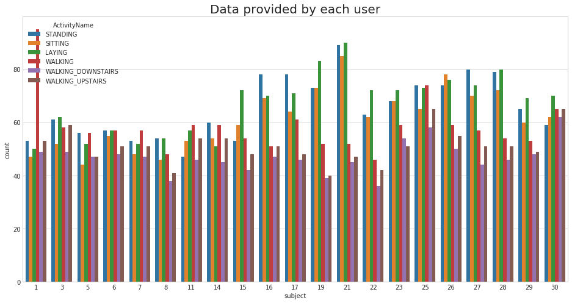


> We have got almost same number of reading from all the subjects


```python
plt.title('No of Datapoints per Activity', fontsize=15)
sns.countplot(train.ActivityName)
plt.xticks(rotation=90)
plt.show()
```


### Observation
> Our data is well balanced (almost)

## 4. Changing feature names 


```python
columns = train.columns

# Removing '()' from column names
columns = columns.str.replace('[()]','')
columns = columns.str.replace('[-]', '')
columns = columns.str.replace('[,]','')

train.columns = columns
test.columns = columns

test.columns
```


    Index(['tBodyAccmeanX', 'tBodyAccmeanY', 'tBodyAccmeanZ', 'tBodyAccstdX',
           'tBodyAccstdY', 'tBodyAccstdZ', 'tBodyAccmadX', 'tBodyAccmadY',
           'tBodyAccmadZ', 'tBodyAccmaxX',
           ...
           'angletBodyAccMeangravity', 'angletBodyAccJerkMeangravityMean',
           'angletBodyGyroMeangravityMean', 'angletBodyGyroJerkMeangravityMean',
           'angleXgravityMean', 'angleYgravityMean', 'angleZgravityMean',
           'subject', 'Activity', 'ActivityName'],
          dtype='object', length=564)


## 5. Save this dataframe in a csv files


```python
train.to_csv('UCI_HAR_Dataset/csv_files/train.csv', index=False)
test.to_csv('UCI_HAR_Dataset/csv_files/test.csv', index=False)
```

 

# Exploratory Data Analysis

"___Without domain knowledge EDA has no meaning, without EDA a problem has no soul.___"

### 1. Featuring Engineering from Domain Knowledge 


+ __Static and Dynamic Activities__

    - In static activities (sit, stand, lie down) motion information will not be very useful.
	- In the dynamic activities (Walking, WalkingUpstairs,WalkingDownstairs) motion info will be significant.


### 2. Stationary and Moving activities are completely different


```python
sns.set_palette("Set1", desat=0.80)
facetgrid = sns.FacetGrid(train, hue='ActivityName', size=6,aspect=2)
facetgrid.map(sns.distplot,'tBodyAccMagmean', hist=False)\
    .add_legend()
plt.annotate("Stationary Activities", xy=(-0.956,17), xytext=(-0.9, 23), size=20,\
            va='center', ha='left',\
            arrowprops=dict(arrowstyle="simple",connectionstyle="arc3,rad=0.1"))

plt.annotate("Moving Activities", xy=(0,3), xytext=(0.2, 9), size=20,\
            va='center', ha='left',\
            arrowprops=dict(arrowstyle="simple",connectionstyle="arc3,rad=0.1"))
plt.show()
```


```python
# for plotting purposes taking datapoints of each activity to a different dataframe
df1 = train[train['Activity']==1]
df2 = train[train['Activity']==2]
df3 = train[train['Activity']==3]
df4 = train[train['Activity']==4]
df5 = train[train['Activity']==5]
df6 = train[train['Activity']==6]

plt.figure(figsize=(14,7))
plt.subplot(2,2,1)
plt.title('Stationary Activities(Zoomed in)')
sns.distplot(df4['tBodyAccMagmean'],color = 'r',hist = False, label = 'Sitting')
sns.distplot(df5['tBodyAccMagmean'],color = 'm',hist = False,label = 'Standing')
sns.distplot(df6['tBodyAccMagmean'],color = 'c',hist = False, label = 'Laying')
plt.axis([-1.01, -0.5, 0, 35])
plt.legend(loc='center')

plt.subplot(2,2,2)
plt.title('Moving Activities')
sns.distplot(df1['tBodyAccMagmean'],color = 'red',hist = False, label = 'Walking')
sns.distplot(df2['tBodyAccMagmean'],color = 'blue',hist = False,label = 'Walking Up')
sns.distplot(df3['tBodyAccMagmean'],color = 'green',hist = False, label = 'Walking down')
plt.legend(loc='center right')


plt.tight_layout()
plt.show()
```


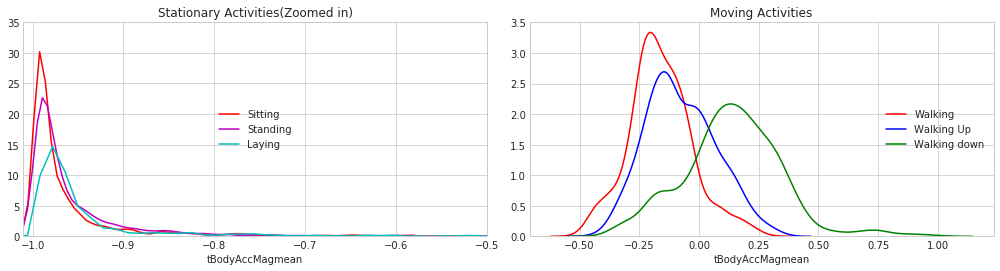


### 3. Magnitude of an acceleration can saperate it well


```python
plt.figure(figsize=(7,7))
sns.boxplot(x='ActivityName', y='tBodyAccMagmean',data=train, showfliers=False, saturation=1)
plt.ylabel('Acceleration Magnitude mean')
plt.axhline(y=-0.7, xmin=0.1, xmax=0.9,dashes=(5,5), c='g')
plt.axhline(y=-0.05, xmin=0.4, dashes=(5,5), c='m')
plt.xticks(rotation=90)
plt.show()
```


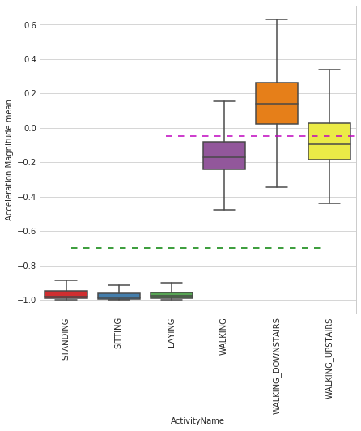


__ Observations__:
- If tAccMean is < -0.8 then the Activities are either Standing or Sitting or Laying.
- If tAccMean is > -0.6 then the Activities are either Walking or WalkingDownstairs or WalkingUpstairs.
- If tAccMean > 0.0 then the Activity is WalkingDownstairs.
- We can classify 75% the Acitivity labels with some errors.

### 4. Position of GravityAccelerationComponants also matters 


```python
sns.boxplot(x='ActivityName', y='angleXgravityMean', data=train)
plt.axhline(y=0.08, xmin=0.1, xmax=0.9,c='m',dashes=(5,3))
plt.title('Angle between X-axis and Gravity_mean', fontsize=15)
plt.xticks(rotation = 40)
plt.show()
```


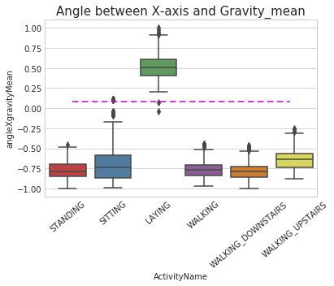


__ Observations__:
* If angleX,gravityMean > 0 then Activity is Laying.
* We can classify all datapoints belonging to Laying activity with just a single if else statement.


```python
sns.boxplot(x='ActivityName', y='angleYgravityMean', data = train, showfliers=False)
plt.title('Angle between Y-axis and Gravity_mean', fontsize=15)
plt.xticks(rotation = 40)
plt.axhline(y=-0.22, xmin=0.1, xmax=0.8, dashes=(5,3), c='m')
plt.show()
```


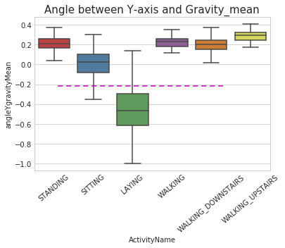


 

 

 

# T-SNE visualisation of data 


```python
import numpy as np
from sklearn.manifold import TSNE
import matplotlib.pyplot as plt
import seaborn as sns
```


```python
# performs t-sne with different perplexity values and their repective plots..

def perform_tsne(X_data, y_data, perplexities, n_iter=1000, img_name_prefix='t-sne'):
        
    for index,perplexity in enumerate(perplexities):
        # perform t-sne
        print('\nperforming tsne with perplexity {} and with {} iterations at max'.format(perplexity, n_iter))
        X_reduced = TSNE(verbose=2, perplexity=perplexity).fit_transform(X_data)
        print('Done..')
        
        # prepare the data for seaborn         
        print('Creating plot for this t-sne visualization..')
        df = pd.DataFrame({'x':X_reduced[:,0], 'y':X_reduced[:,1] ,'label':y_data})
        
        # draw the plot in appropriate place in the grid
        sns.lmplot(data=df, x='x', y='y', hue='label', fit_reg=False, size=8,\
                   palette="Set1",markers=['^','v','s','o', '1','2'])
        plt.title("perplexity : {} and max_iter : {}".format(perplexity, n_iter))
        img_name = img_name_prefix + '_perp_{}_iter_{}.png'.format(perplexity, n_iter)
        print('saving this plot as image in present working directory...')
        plt.savefig(img_name)
        plt.show()
        print('Done')

```


```python
X_pre_tsne = train.drop(['subject', 'Activity','ActivityName'], axis=1)
y_pre_tsne = train['ActivityName']
perform_tsne(X_data = X_pre_tsne,y_data=y_pre_tsne, perplexities =[2,5,10,20,50])
```

    
    performing tsne with perplexity 2 and with 1000 iterations at max
    [t-SNE] Computing 7 nearest neighbors...
    [t-SNE] Indexed 7352 samples in 0.426s...
    [t-SNE] Computed neighbors for 7352 samples in 72.001s...
    [t-SNE] Computed conditional probabilities for sample 1000 / 7352
    [t-SNE] Computed conditional probabilities for sample 2000 / 7352
    [t-SNE] Computed conditional probabilities for sample 3000 / 7352
    [t-SNE] Computed conditional probabilities for sample 4000 / 7352
    [t-SNE] Computed conditional probabilities for sample 5000 / 7352
    [t-SNE] Computed conditional probabilities for sample 6000 / 7352
    [t-SNE] Computed conditional probabilities for sample 7000 / 7352
    [t-SNE] Computed conditional probabilities for sample 7352 / 7352
    [t-SNE] Mean sigma: 0.635855
    [t-SNE] Computed conditional probabilities in 0.071s
    [t-SNE] Iteration 50: error = 124.8017578, gradient norm = 0.0253939 (50 iterations in 16.625s)
    [t-SNE] Iteration 100: error = 107.2019501, gradient norm = 0.0284782 (50 iterations in 9.735s)
    [t-SNE] Iteration 150: error = 100.9872894, gradient norm = 0.0185151 (50 iterations in 5.346s)
    [t-SNE] Iteration 200: error = 97.6054382, gradient norm = 0.0142084 (50 iterations in 7.013s)
    [t-SNE] Iteration 250: error = 95.3084183, gradient norm = 0.0132592 (50 iterations in 5.703s)
    [t-SNE] KL divergence after 250 iterations with early exaggeration: 95.308418
    [t-SNE] Iteration 300: error = 4.1209540, gradient norm = 0.0015668 (50 iterations in 7.156s)
    [t-SNE] Iteration 350: error = 3.2113254, gradient norm = 0.0009953 (50 iterations in 8.022s)
    [t-SNE] Iteration 400: error = 2.7819963, gradient norm = 0.0007203 (50 iterations in 9.419s)
    [t-SNE] Iteration 450: error = 2.5178111, gradient norm = 0.0005655 (50 iterations in 9.370s)
    [t-SNE] Iteration 500: error = 2.3341548, gradient norm = 0.0004804 (50 iterations in 7.681s)
    [t-SNE] Iteration 550: error = 2.1961622, gradient norm = 0.0004183 (50 iterations in 7.097s)
    [t-SNE] Iteration 600: error = 2.0867445, gradient norm = 0.0003664 (50 iterations in 9.274s)
    [t-SNE] Iteration 650: error = 1.9967778, gradient norm = 0.0003279 (50 iterations in 7.697s)
    [t-SNE] Iteration 700: error = 1.9210005, gradient norm = 0.0002984 (50 iterations in 8.174s)
    [t-SNE] Iteration 750: error = 1.8558111, gradient norm = 0.0002776 (50 iterations in 9.747s)
    [t-SNE] Iteration 800: error = 1.7989457, gradient norm = 0.0002569 (50 iterations in 8.687s)
    [t-SNE] Iteration 850: error = 1.7490212, gradient norm = 0.0002394 (50 iterations in 8.407s)
    [t-SNE] Iteration 900: error = 1.7043383, gradient norm = 0.0002224 (50 iterations in 8.351s)
    [t-SNE] Iteration 950: error = 1.6641431, gradient norm = 0.0002098 (50 iterations in 7.841s)
    [t-SNE] Iteration 1000: error = 1.6279151, gradient norm = 0.0001989 (50 iterations in 5.623s)
    [t-SNE] Error after 1000 iterations: 1.627915
    Done..
    Creating plot for this t-sne visualization..
    saving this plot as image in present working directory...
    


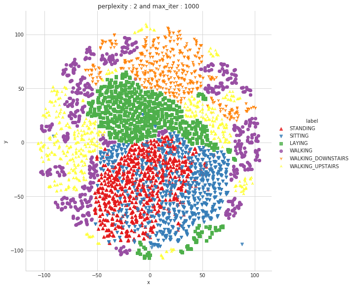


    Done
    
    performing tsne with perplexity 5 and with 1000 iterations at max
    [t-SNE] Computing 16 nearest neighbors...
    [t-SNE] Indexed 7352 samples in 0.263s...
    [t-SNE] Computed neighbors for 7352 samples in 48.983s...
    [t-SNE] Computed conditional probabilities for sample 1000 / 7352
    [t-SNE] Computed conditional probabilities for sample 2000 / 7352
    [t-SNE] Computed conditional probabilities for sample 3000 / 7352
    [t-SNE] Computed conditional probabilities for sample 4000 / 7352
    [t-SNE] Computed conditional probabilities for sample 5000 / 7352
    [t-SNE] Computed conditional probabilities for sample 6000 / 7352
    [t-SNE] Computed conditional probabilities for sample 7000 / 7352
    [t-SNE] Computed conditional probabilities for sample 7352 / 7352
    [t-SNE] Mean sigma: 0.961265
    [t-SNE] Computed conditional probabilities in 0.122s
    [t-SNE] Iteration 50: error = 114.1862640, gradient norm = 0.0184120 (50 iterations in 55.655s)
    [t-SNE] Iteration 100: error = 97.6535568, gradient norm = 0.0174309 (50 iterations in 12.580s)
    [t-SNE] Iteration 150: error = 93.1900101, gradient norm = 0.0101048 (50 iterations in 9.180s)
    [t-SNE] Iteration 200: error = 91.2315445, gradient norm = 0.0074560 (50 iterations in 10.340s)
    [t-SNE] Iteration 250: error = 90.0714417, gradient norm = 0.0057667 (50 iterations in 9.458s)
    [t-SNE] KL divergence after 250 iterations with early exaggeration: 90.071442
    [t-SNE] Iteration 300: error = 3.5796804, gradient norm = 0.0014691 (50 iterations in 8.718s)
    [t-SNE] Iteration 350: error = 2.8173938, gradient norm = 0.0007508 (50 iterations in 10.180s)
    [t-SNE] Iteration 400: error = 2.4344938, gradient norm = 0.0005251 (50 iterations in 10.506s)
    [t-SNE] Iteration 450: error = 2.2156141, gradient norm = 0.0004069 (50 iterations in 10.072s)
    [t-SNE] Iteration 500: error = 2.0703306, gradient norm = 0.0003340 (50 iterations in 10.511s)
    [t-SNE] Iteration 550: error = 1.9646366, gradient norm = 0.0002816 (50 iterations in 9.792s)
    [t-SNE] Iteration 600: error = 1.8835558, gradient norm = 0.0002471 (50 iterations in 9.098s)
    [t-SNE] Iteration 650: error = 1.8184001, gradient norm = 0.0002184 (50 iterations in 8.656s)
    [t-SNE] Iteration 700: error = 1.7647167, gradient norm = 0.0001961 (50 iterations in 9.063s)
    [t-SNE] Iteration 750: error = 1.7193680, gradient norm = 0.0001796 (50 iterations in 9.754s)
    [t-SNE] Iteration 800: error = 1.6803776, gradient norm = 0.0001655 (50 iterations in 9.540s)
    [t-SNE] Iteration 850: error = 1.6465144, gradient norm = 0.0001538 (50 iterations in 9.953s)
    [t-SNE] Iteration 900: error = 1.6166563, gradient norm = 0.0001421 (50 iterations in 10.270s)
    [t-SNE] Iteration 950: error = 1.5901035, gradient norm = 0.0001335 (50 iterations in 6.609s)
    [t-SNE] Iteration 1000: error = 1.5664237, gradient norm = 0.0001257 (50 iterations in 8.553s)
    [t-SNE] Error after 1000 iterations: 1.566424
    Done..
    Creating plot for this t-sne visualization..
    saving this plot as image in present working directory...
    


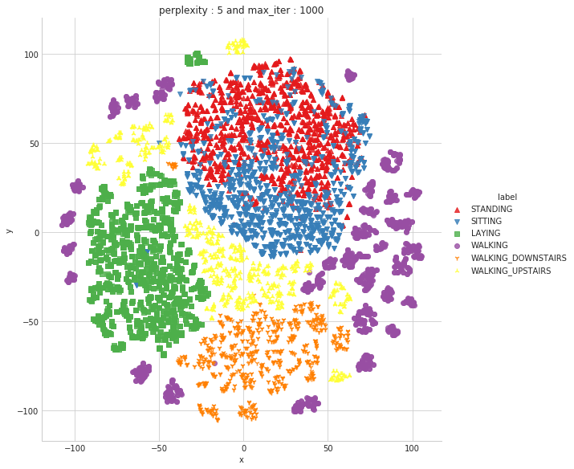


    Done
    
    performing tsne with perplexity 10 and with 1000 iterations at max
    [t-SNE] Computing 31 nearest neighbors...
    [t-SNE] Indexed 7352 samples in 0.410s...
    [t-SNE] Computed neighbors for 7352 samples in 64.801s...
    [t-SNE] Computed conditional probabilities for sample 1000 / 7352
    [t-SNE] Computed conditional probabilities for sample 2000 / 7352
    [t-SNE] Computed conditional probabilities for sample 3000 / 7352
    [t-SNE] Computed conditional probabilities for sample 4000 / 7352
    [t-SNE] Computed conditional probabilities for sample 5000 / 7352
    [t-SNE] Computed conditional probabilities for sample 6000 / 7352
    [t-SNE] Computed conditional probabilities for sample 7000 / 7352
    [t-SNE] Computed conditional probabilities for sample 7352 / 7352
    [t-SNE] Mean sigma: 1.133828
    [t-SNE] Computed conditional probabilities in 0.214s
    [t-SNE] Iteration 50: error = 106.0169220, gradient norm = 0.0194293 (50 iterations in 24.550s)
    [t-SNE] Iteration 100: error = 90.3036194, gradient norm = 0.0097653 (50 iterations in 11.936s)
    [t-SNE] Iteration 150: error = 87.3132935, gradient norm = 0.0053059 (50 iterations in 11.246s)
    [t-SNE] Iteration 200: error = 86.1169128, gradient norm = 0.0035844 (50 iterations in 11.864s)
    [t-SNE] Iteration 250: error = 85.4133606, gradient norm = 0.0029100 (50 iterations in 11.944s)
    [t-SNE] KL divergence after 250 iterations with early exaggeration: 85.413361
    [t-SNE] Iteration 300: error = 3.1394315, gradient norm = 0.0013976 (50 iterations in 11.742s)
    [t-SNE] Iteration 350: error = 2.4929206, gradient norm = 0.0006466 (50 iterations in 11.627s)
    [t-SNE] Iteration 400: error = 2.1733041, gradient norm = 0.0004230 (50 iterations in 11.846s)
    [t-SNE] Iteration 450: error = 1.9884514, gradient norm = 0.0003124 (50 iterations in 11.405s)
    [t-SNE] Iteration 500: error = 1.8702440, gradient norm = 0.0002514 (50 iterations in 11.320s)
    [t-SNE] Iteration 550: error = 1.7870129, gradient norm = 0.0002107 (50 iterations in 12.009s)
    [t-SNE] Iteration 600: error = 1.7246909, gradient norm = 0.0001824 (50 iterations in 10.632s)
    [t-SNE] Iteration 650: error = 1.6758548, gradient norm = 0.0001590 (50 iterations in 11.270s)
    [t-SNE] Iteration 700: error = 1.6361949, gradient norm = 0.0001451 (50 iterations in 12.072s)
    [t-SNE] Iteration 750: error = 1.6034756, gradient norm = 0.0001305 (50 iterations in 11.607s)
    [t-SNE] Iteration 800: error = 1.5761518, gradient norm = 0.0001188 (50 iterations in 9.409s)
    [t-SNE] Iteration 850: error = 1.5527289, gradient norm = 0.0001113 (50 iterations in 8.309s)
    [t-SNE] Iteration 900: error = 1.5328671, gradient norm = 0.0001021 (50 iterations in 9.433s)
    [t-SNE] Iteration 950: error = 1.5152045, gradient norm = 0.0000974 (50 iterations in 11.488s)
    [t-SNE] Iteration 1000: error = 1.4999681, gradient norm = 0.0000933 (50 iterations in 10.593s)
    [t-SNE] Error after 1000 iterations: 1.499968
    Done..
    Creating plot for this t-sne visualization..
    saving this plot as image in present working directory...
    


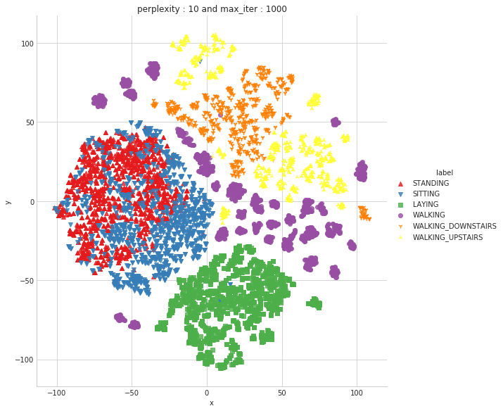


    Done
    
    performing tsne with perplexity 20 and with 1000 iterations at max
    [t-SNE] Computing 61 nearest neighbors...
    [t-SNE] Indexed 7352 samples in 0.425s...
    [t-SNE] Computed neighbors for 7352 samples in 61.792s...
    [t-SNE] Computed conditional probabilities for sample 1000 / 7352
    [t-SNE] Computed conditional probabilities for sample 2000 / 7352
    [t-SNE] Computed conditional probabilities for sample 3000 / 7352
    [t-SNE] Computed conditional probabilities for sample 4000 / 7352
    [t-SNE] Computed conditional probabilities for sample 5000 / 7352
    [t-SNE] Computed conditional probabilities for sample 6000 / 7352
    [t-SNE] Computed conditional probabilities for sample 7000 / 7352
    [t-SNE] Computed conditional probabilities for sample 7352 / 7352
    [t-SNE] Mean sigma: 1.274335
    [t-SNE] Computed conditional probabilities in 0.355s
    [t-SNE] Iteration 50: error = 97.5202179, gradient norm = 0.0223863 (50 iterations in 21.168s)
    [t-SNE] Iteration 100: error = 83.9500732, gradient norm = 0.0059110 (50 iterations in 17.306s)
    [t-SNE] Iteration 150: error = 81.8804779, gradient norm = 0.0035797 (50 iterations in 14.258s)
    [t-SNE] Iteration 200: error = 81.1615143, gradient norm = 0.0022536 (50 iterations in 14.130s)
    [t-SNE] Iteration 250: error = 80.7704086, gradient norm = 0.0018108 (50 iterations in 15.340s)
    [t-SNE] KL divergence after 250 iterations with early exaggeration: 80.770409
    [t-SNE] Iteration 300: error = 2.6957574, gradient norm = 0.0012993 (50 iterations in 13.605s)
    [t-SNE] Iteration 350: error = 2.1637220, gradient norm = 0.0005765 (50 iterations in 13.248s)
    [t-SNE] Iteration 400: error = 1.9143614, gradient norm = 0.0003474 (50 iterations in 14.774s)
    [t-SNE] Iteration 450: error = 1.7684202, gradient norm = 0.0002458 (50 iterations in 15.502s)
    [t-SNE] Iteration 500: error = 1.6744757, gradient norm = 0.0001923 (50 iterations in 14.808s)
    [t-SNE] Iteration 550: error = 1.6101606, gradient norm = 0.0001575 (50 iterations in 14.043s)
    [t-SNE] Iteration 600: error = 1.5641028, gradient norm = 0.0001344 (50 iterations in 15.769s)
    [t-SNE] Iteration 650: error = 1.5291905, gradient norm = 0.0001182 (50 iterations in 15.834s)
    [t-SNE] Iteration 700: error = 1.5024391, gradient norm = 0.0001055 (50 iterations in 15.398s)
    [t-SNE] Iteration 750: error = 1.4809053, gradient norm = 0.0000965 (50 iterations in 14.594s)
    [t-SNE] Iteration 800: error = 1.4631859, gradient norm = 0.0000884 (50 iterations in 15.025s)
    [t-SNE] Iteration 850: error = 1.4486470, gradient norm = 0.0000832 (50 iterations in 14.060s)
    [t-SNE] Iteration 900: error = 1.4367288, gradient norm = 0.0000804 (50 iterations in 12.389s)
    [t-SNE] Iteration 950: error = 1.4270191, gradient norm = 0.0000761 (50 iterations in 10.392s)
    [t-SNE] Iteration 1000: error = 1.4189968, gradient norm = 0.0000787 (50 iterations in 12.355s)
    [t-SNE] Error after 1000 iterations: 1.418997
    Done..
    Creating plot for this t-sne visualization..
    saving this plot as image in present working directory...
    


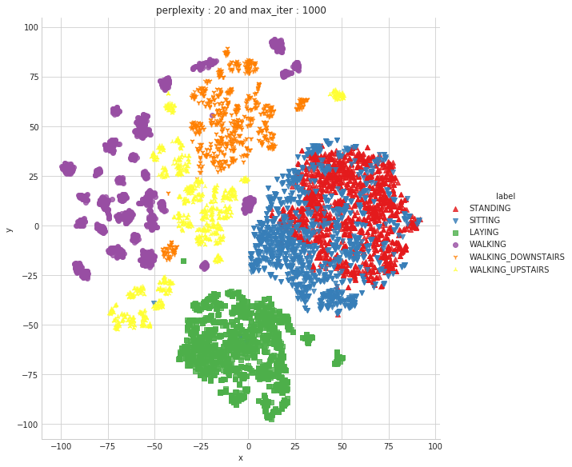


    Done
    
    performing tsne with perplexity 50 and with 1000 iterations at max
    [t-SNE] Computing 151 nearest neighbors...
    [t-SNE] Indexed 7352 samples in 0.376s...
    [t-SNE] Computed neighbors for 7352 samples in 73.164s...
    [t-SNE] Computed conditional probabilities for sample 1000 / 7352
    [t-SNE] Computed conditional probabilities for sample 2000 / 7352
    [t-SNE] Computed conditional probabilities for sample 3000 / 7352
    [t-SNE] Computed conditional probabilities for sample 4000 / 7352
    [t-SNE] Computed conditional probabilities for sample 5000 / 7352
    [t-SNE] Computed conditional probabilities for sample 6000 / 7352
    [t-SNE] Computed conditional probabilities for sample 7000 / 7352
    [t-SNE] Computed conditional probabilities for sample 7352 / 7352
    [t-SNE] Mean sigma: 1.437672
    [t-SNE] Computed conditional probabilities in 0.844s
    [t-SNE] Iteration 50: error = 86.1525574, gradient norm = 0.0242986 (50 iterations in 36.249s)
    [t-SNE] Iteration 100: error = 75.9874649, gradient norm = 0.0061005 (50 iterations in 30.453s)
    [t-SNE] Iteration 150: error = 74.7072296, gradient norm = 0.0024708 (50 iterations in 28.461s)
    [t-SNE] Iteration 200: error = 74.2736282, gradient norm = 0.0018644 (50 iterations in 27.735s)
    [t-SNE] Iteration 250: error = 74.0722427, gradient norm = 0.0014078 (50 iterations in 26.835s)
    [t-SNE] KL divergence after 250 iterations with early exaggeration: 74.072243
    [t-SNE] Iteration 300: error = 2.1539080, gradient norm = 0.0011796 (50 iterations in 25.445s)
    [t-SNE] Iteration 350: error = 1.7567128, gradient norm = 0.0004845 (50 iterations in 21.282s)
    [t-SNE] Iteration 400: error = 1.5888531, gradient norm = 0.0002798 (50 iterations in 21.015s)
    [t-SNE] Iteration 450: error = 1.4956820, gradient norm = 0.0001894 (50 iterations in 23.332s)
    [t-SNE] Iteration 500: error = 1.4359720, gradient norm = 0.0001420 (50 iterations in 23.083s)
    [t-SNE] Iteration 550: error = 1.3947564, gradient norm = 0.0001117 (50 iterations in 19.626s)
    [t-SNE] Iteration 600: error = 1.3653858, gradient norm = 0.0000949 (50 iterations in 22.752s)
    [t-SNE] Iteration 650: error = 1.3441534, gradient norm = 0.0000814 (50 iterations in 23.972s)
    [t-SNE] Iteration 700: error = 1.3284039, gradient norm = 0.0000742 (50 iterations in 20.636s)
    [t-SNE] Iteration 750: error = 1.3171139, gradient norm = 0.0000700 (50 iterations in 20.407s)
    [t-SNE] Iteration 800: error = 1.3085558, gradient norm = 0.0000657 (50 iterations in 24.951s)
    [t-SNE] Iteration 850: error = 1.3017821, gradient norm = 0.0000603 (50 iterations in 24.719s)
    [t-SNE] Iteration 900: error = 1.2962619, gradient norm = 0.0000586 (50 iterations in 24.500s)
    [t-SNE] Iteration 950: error = 1.2914882, gradient norm = 0.0000573 (50 iterations in 24.132s)
    [t-SNE] Iteration 1000: error = 1.2874244, gradient norm = 0.0000546 (50 iterations in 22.840s)
    [t-SNE] Error after 1000 iterations: 1.287424
    Done..
    Creating plot for this t-sne visualization..
    saving this plot as image in present working directory...
    


    Done
    

### Observation :  
Almost all the activities except standing and sitting have well defined seperate clusters . It can be challenging to seperate standing and sitting when we do modelling. 

# Classical ML modelling on expert generated features

## Obtain the train and test data


```python
train = pd.read_csv('UCI_HAR_dataset/csv_files/train.csv')
test = pd.read_csv('UCI_HAR_dataset/csv_files/test.csv')
print(train.shape, test.shape)


```

    (7352, 564) (2947, 564)
    


```python
train.head(3)
```


<div>
<style scoped>
    .dataframe tbody tr th:only-of-type {
        vertical-align: middle;
    }

    .dataframe tbody tr th {
        vertical-align: top;
    }

    .dataframe thead th {
        text-align: right;
    }
</style>
<table border="1" class="dataframe">
  <thead>
    <tr style="text-align: right;">
      <th></th>
      <th>tBodyAccmeanX</th>
      <th>tBodyAccmeanY</th>
      <th>tBodyAccmeanZ</th>
      <th>tBodyAccstdX</th>
      <th>tBodyAccstdY</th>
      <th>tBodyAccstdZ</th>
      <th>tBodyAccmadX</th>
      <th>tBodyAccmadY</th>
      <th>tBodyAccmadZ</th>
      <th>tBodyAccmaxX</th>
      <th>...</th>
      <th>angletBodyAccMeangravity</th>
      <th>angletBodyAccJerkMeangravityMean</th>
      <th>angletBodyGyroMeangravityMean</th>
      <th>angletBodyGyroJerkMeangravityMean</th>
      <th>angleXgravityMean</th>
      <th>angleYgravityMean</th>
      <th>angleZgravityMean</th>
      <th>subject</th>
      <th>Activity</th>
      <th>ActivityName</th>
    </tr>
  </thead>
  <tbody>
    <tr>
      <th>0</th>
      <td>0.288585</td>
      <td>-0.020294</td>
      <td>-0.132905</td>
      <td>-0.995279</td>
      <td>-0.983111</td>
      <td>-0.913526</td>
      <td>-0.995112</td>
      <td>-0.983185</td>
      <td>-0.923527</td>
      <td>-0.934724</td>
      <td>...</td>
      <td>-0.112754</td>
      <td>0.030400</td>
      <td>-0.464761</td>
      <td>-0.018446</td>
      <td>-0.841247</td>
      <td>0.179941</td>
      <td>-0.058627</td>
      <td>1</td>
      <td>5</td>
      <td>STANDING</td>
    </tr>
    <tr>
      <th>1</th>
      <td>0.278419</td>
      <td>-0.016411</td>
      <td>-0.123520</td>
      <td>-0.998245</td>
      <td>-0.975300</td>
      <td>-0.960322</td>
      <td>-0.998807</td>
      <td>-0.974914</td>
      <td>-0.957686</td>
      <td>-0.943068</td>
      <td>...</td>
      <td>0.053477</td>
      <td>-0.007435</td>
      <td>-0.732626</td>
      <td>0.703511</td>
      <td>-0.844788</td>
      <td>0.180289</td>
      <td>-0.054317</td>
      <td>1</td>
      <td>5</td>
      <td>STANDING</td>
    </tr>
    <tr>
      <th>2</th>
      <td>0.279653</td>
      <td>-0.019467</td>
      <td>-0.113462</td>
      <td>-0.995380</td>
      <td>-0.967187</td>
      <td>-0.978944</td>
      <td>-0.996520</td>
      <td>-0.963668</td>
      <td>-0.977469</td>
      <td>-0.938692</td>
      <td>...</td>
      <td>-0.118559</td>
      <td>0.177899</td>
      <td>0.100699</td>
      <td>0.808529</td>
      <td>-0.848933</td>
      <td>0.180637</td>
      <td>-0.049118</td>
      <td>1</td>
      <td>5</td>
      <td>STANDING</td>
    </tr>
  </tbody>
</table>
<p>3 rows × 564 columns</p>
</div>


```python
# get X_train and y_train from csv files
X_train = train.drop(['subject', 'Activity', 'ActivityName'], axis=1)
y_train = train.ActivityName
```


```python
# get X_test and y_test from test csv file
X_test = test.drop(['subject', 'Activity', 'ActivityName'], axis=1)
y_test = test.ActivityName
```


```python
print('X_train and y_train : ({},{})'.format(X_train.shape, y_train.shape))
print('X_test  and y_test  : ({},{})'.format(X_test.shape, y_test.shape))
```

    X_train and y_train : ((7352, 561),(7352,))
    X_test  and y_test  : ((2947, 561),(2947,))
    

 

 

### Labels that are useful in plotting confusion matrix


```python
labels=['LAYING', 'SITTING','STANDING','WALKING','WALKING_DOWNSTAIRS','WALKING_UPSTAIRS']
```

### Function to plot the confusion matrix


```python
import itertools
import numpy as np
import matplotlib.pyplot as plt
from sklearn.metrics import confusion_matrix
plt.rcParams["font.family"] = 'DejaVu Sans'

def plot_confusion_matrix(cm, classes,
                          normalize=False,
                          title='Confusion matrix',
                          cmap=plt.cm.Blues):
    if normalize:
        cm = cm.astype('float') / cm.sum(axis=1)[:, np.newaxis]

    plt.imshow(cm, interpolation='nearest', cmap=cmap)
    plt.title(title)
    plt.colorbar()
    tick_marks = np.arange(len(classes))
    plt.xticks(tick_marks, classes, rotation=90)
    plt.yticks(tick_marks, classes)

    fmt = '.2f' if normalize else 'd'
    thresh = cm.max() / 2.
    for i, j in itertools.product(range(cm.shape[0]), range(cm.shape[1])):
        plt.text(j, i, format(cm[i, j], fmt),
                 horizontalalignment="center",
                 color="white" if cm[i, j] > thresh else "black")

    plt.tight_layout()
    plt.ylabel('True label')
    plt.xlabel('Predicted label')
```

### Generic function to run any model specified


```python
from datetime import datetime
def perform_model(model, X_train, y_train, X_test, y_test, class_labels, cm_normalize=True, \
                 print_cm=True, cm_cmap=plt.cm.Greens):
    
    
    # to store results at various phases
    results = dict()
    
    # time at which model starts training 
    train_start_time = datetime.now()
    print('training the model..')
    model.fit(X_train, y_train)
    print('Done \n \n')
    train_end_time = datetime.now()
    results['training_time'] =  train_end_time - train_start_time
    print('training_time(HH:MM:SS.ms) - {}\n\n'.format(results['training_time']))
    
    
    # predict test data
    print('Predicting test data')
    test_start_time = datetime.now()
    y_pred = model.predict(X_test)
    test_end_time = datetime.now()
    print('Done \n \n')
    results['testing_time'] = test_end_time - test_start_time
    print('testing time(HH:MM:SS:ms) - {}\n\n'.format(results['testing_time']))
    results['predicted'] = y_pred
   

    # calculate overall accuracty of the model
    accuracy = metrics.accuracy_score(y_true=y_test, y_pred=y_pred)
    # store accuracy in results
    results['accuracy'] = accuracy
    print('---------------------')
    print('|      Accuracy      |')
    print('---------------------')
    print('\n    {}\n\n'.format(accuracy))
    
    
    # confusion matrix
    cm = metrics.confusion_matrix(y_test, y_pred)
    results['confusion_matrix'] = cm
    if print_cm: 
        print('--------------------')
        print('| Confusion Matrix |')
        print('--------------------')
        print('\n {}'.format(cm))
        
    # plot confusin matrix
    plt.figure(figsize=(8,8))
    plt.grid(b=False)
    plot_confusion_matrix(cm, classes=class_labels, normalize=True, title='Normalized confusion matrix', cmap = cm_cmap)
    plt.show()
    
    # get classification report
    print('-------------------------')
    print('| Classifiction Report |')
    print('-------------------------')
    classification_report = metrics.classification_report(y_test, y_pred)
    # store report in results
    results['classification_report'] = classification_report
    print(classification_report)
    
    # add the trained  model to the results
    results['model'] = model
    
    return results
    
    
```

### Method to print the gridsearch Attributes


```python
def print_grid_search_attributes(model):
    # Estimator that gave highest score among all the estimators formed in GridSearch
    print('--------------------------')
    print('|      Best Estimator     |')
    print('--------------------------')
    print('\n\t{}\n'.format(model.best_estimator_))


    # parameters that gave best results while performing grid search
    print('--------------------------')
    print('|     Best parameters     |')
    print('--------------------------')
    print('\tParameters of best estimator : \n\n\t{}\n'.format(model.best_params_))


    #  number of cross validation splits
    print('---------------------------------')
    print('|   No of CrossValidation sets   |')
    print('--------------------------------')
    print('\n\tTotal numbre of cross validation sets: {}\n'.format(model.n_splits_))


    # Average cross validated score of the best estimator, from the Grid Search 
    print('--------------------------')
    print('|        Best Score       |')
    print('--------------------------')
    print('\n\tAverage Cross Validate scores of best estimator : \n\n\t{}\n'.format(model.best_score_))

    
    
```

 

 

 

## 1. Logistic Regression with Grid Search


```python
from sklearn import linear_model
from sklearn import metrics

from sklearn.model_selection import GridSearchCV
```


```python

# start Grid search
parameters = {'C':[0.01, 0.1, 1, 10, 20, 30], 'penalty':['l2','l1']}
log_reg = linear_model.LogisticRegression()
log_reg_grid = GridSearchCV(log_reg, param_grid=parameters, cv=3, verbose=1, n_jobs=-1)
log_reg_grid_results =  perform_model(log_reg_grid, X_train, y_train, X_test, y_test, class_labels=labels)

```

    training the model..
    Fitting 3 folds for each of 12 candidates, totalling 36 fits
    

    [Parallel(n_jobs=-1)]: Done  36 out of  36 | elapsed:  1.2min finished
    

    Done 
     
    
    training_time(HH:MM:SS.ms) - 0:01:25.843810
    
    
    Predicting test data
    Done 
     
    
    testing time(HH:MM:SS:ms) - 0:00:00.009192
    
    
    ---------------------
    |      Accuracy      |
    ---------------------
    
        0.9626739056667798
    
    
    --------------------
    | Confusion Matrix |
    --------------------
    
     [[537   0   0   0   0   0]
     [  1 428  58   0   0   4]
     [  0  12 519   1   0   0]
     [  0   0   0 495   1   0]
     [  0   0   0   3 409   8]
     [  0   0   0  22   0 449]]
    


    -------------------------
    | Classifiction Report |
    -------------------------
                        precision    recall  f1-score   support
    
                LAYING       1.00      1.00      1.00       537
               SITTING       0.97      0.87      0.92       491
              STANDING       0.90      0.98      0.94       532
               WALKING       0.95      1.00      0.97       496
    WALKING_DOWNSTAIRS       1.00      0.97      0.99       420
      WALKING_UPSTAIRS       0.97      0.95      0.96       471
    
           avg / total       0.96      0.96      0.96      2947
    
    


```python
plt.figure(figsize=(8,8))
plt.grid(b=False)
plot_confusion_matrix(log_reg_grid_results['confusion_matrix'], classes=labels, cmap=plt.cm.Greens, )
plt.show()
```


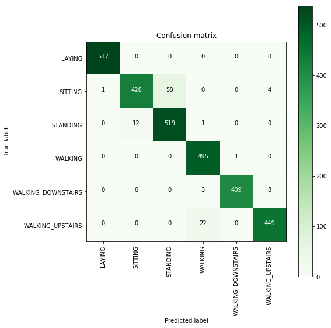


```python
# observe the attributes of the model 
print_grid_search_attributes(log_reg_grid_results['model'])
```

    --------------------------
    |      Best Estimator     |
    --------------------------
    
    	LogisticRegression(C=30, class_weight=None, dual=False, fit_intercept=True,
              intercept_scaling=1, max_iter=100, multi_class='ovr', n_jobs=1,
              penalty='l2', random_state=None, solver='liblinear', tol=0.0001,
              verbose=0, warm_start=False)
    
    --------------------------
    |     Best parameters     |
    --------------------------
    	Parameters of best estimator : 
    
    	{'C': 30, 'penalty': 'l2'}
    
    ---------------------------------
    |   No of CrossValidation sets   |
    --------------------------------
    
    	Total numbre of cross validation sets: 3
    
    --------------------------
    |        Best Score       |
    --------------------------
    
    	Average Cross Validate scores of best estimator : 
    
    	0.9461371055495104
    
    

##  2. Linear SVC with GridSearch


```python
from sklearn.svm import LinearSVC
```


```python
parameters = {'C':[0.125, 0.5, 1, 2, 8, 16]}
lr_svc = LinearSVC(tol=0.00005)
lr_svc_grid = GridSearchCV(lr_svc, param_grid=parameters, n_jobs=-1, verbose=1)
lr_svc_grid_results = perform_model(lr_svc_grid, X_train, y_train, X_test, y_test, class_labels=labels)
```

    training the model..
    Fitting 3 folds for each of 6 candidates, totalling 18 fits
    

    [Parallel(n_jobs=-1)]: Done  18 out of  18 | elapsed:   24.9s finished
    

    Done 
     
    
    training_time(HH:MM:SS.ms) - 0:00:32.951942
    
    
    Predicting test data
    Done 
     
    
    testing time(HH:MM:SS:ms) - 0:00:00.012182
    
    
    ---------------------
    |      Accuracy      |
    ---------------------
    
        0.9660671869697998
    
    
    --------------------
    | Confusion Matrix |
    --------------------
    
     [[537   0   0   0   0   0]
     [  2 426  58   0   0   5]
     [  0  14 518   0   0   0]
     [  0   0   0 495   0   1]
     [  0   0   0   2 413   5]
     [  0   0   0  12   1 458]]
    


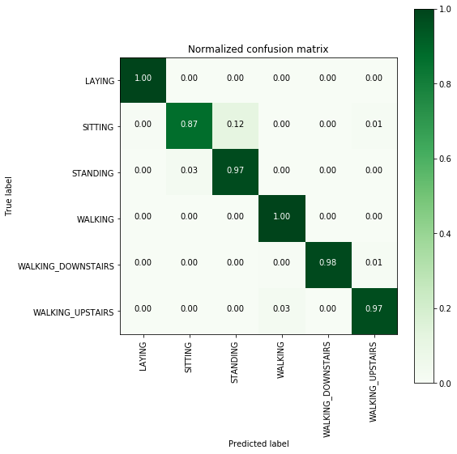


    -------------------------
    | Classifiction Report |
    -------------------------
                        precision    recall  f1-score   support
    
                LAYING       1.00      1.00      1.00       537
               SITTING       0.97      0.87      0.92       491
              STANDING       0.90      0.97      0.94       532
               WALKING       0.97      1.00      0.99       496
    WALKING_DOWNSTAIRS       1.00      0.98      0.99       420
      WALKING_UPSTAIRS       0.98      0.97      0.97       471
    
           avg / total       0.97      0.97      0.97      2947
    
    


```python
print_grid_search_attributes(lr_svc_grid_results['model'])
```

    --------------------------
    |      Best Estimator     |
    --------------------------
    
    	LinearSVC(C=8, class_weight=None, dual=True, fit_intercept=True,
         intercept_scaling=1, loss='squared_hinge', max_iter=1000,
         multi_class='ovr', penalty='l2', random_state=None, tol=5e-05,
         verbose=0)
    
    --------------------------
    |     Best parameters     |
    --------------------------
    	Parameters of best estimator : 
    
    	{'C': 8}
    
    ---------------------------------
    |   No of CrossValidation sets   |
    --------------------------------
    
    	Total numbre of cross validation sets: 3
    
    --------------------------
    |        Best Score       |
    --------------------------
    
    	Average Cross Validate scores of best estimator : 
    
    	0.9465451577801959
    
    

## 3.  Kernel SVM with GridSearch


```python
from sklearn.svm import SVC
parameters = {'C':[2,8,16],\
              'gamma': [ 0.0078125, 0.125, 2]}
rbf_svm = SVC(kernel='rbf')
rbf_svm_grid = GridSearchCV(rbf_svm,param_grid=parameters, n_jobs=-1)
rbf_svm_grid_results = perform_model(rbf_svm_grid, X_train, y_train, X_test, y_test, class_labels=labels)
```

    training the model..
    Done 
     
    
    training_time(HH:MM:SS.ms) - 0:05:46.182889
    
    
    Predicting test data
    Done 
     
    
    testing time(HH:MM:SS:ms) - 0:00:05.221285
    
    
    ---------------------
    |      Accuracy      |
    ---------------------
    
        0.9626739056667798
    
    
    --------------------
    | Confusion Matrix |
    --------------------
    
     [[537   0   0   0   0   0]
     [  0 441  48   0   0   2]
     [  0  12 520   0   0   0]
     [  0   0   0 489   2   5]
     [  0   0   0   4 397  19]
     [  0   0   0  17   1 453]]
    


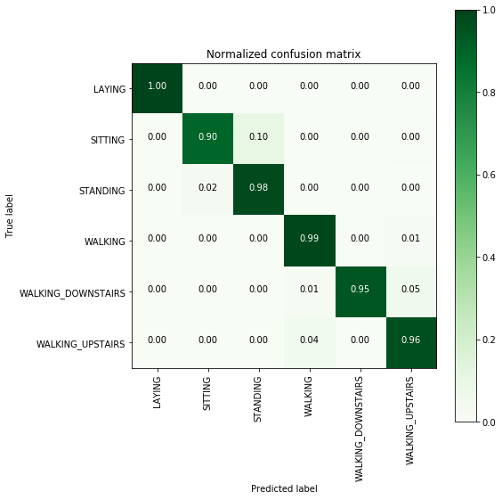


    -------------------------
    | Classifiction Report |
    -------------------------
                        precision    recall  f1-score   support
    
                LAYING       1.00      1.00      1.00       537
               SITTING       0.97      0.90      0.93       491
              STANDING       0.92      0.98      0.95       532
               WALKING       0.96      0.99      0.97       496
    WALKING_DOWNSTAIRS       0.99      0.95      0.97       420
      WALKING_UPSTAIRS       0.95      0.96      0.95       471
    
           avg / total       0.96      0.96      0.96      2947
    
    


```python
print_grid_search_attributes(rbf_svm_grid_results['model'])
```

    --------------------------
    |      Best Estimator     |
    --------------------------
    
    	SVC(C=16, cache_size=200, class_weight=None, coef0=0.0,
      decision_function_shape='ovr', degree=3, gamma=0.0078125, kernel='rbf',
      max_iter=-1, probability=False, random_state=None, shrinking=True,
      tol=0.001, verbose=False)
    
    --------------------------
    |     Best parameters     |
    --------------------------
    	Parameters of best estimator : 
    
    	{'C': 16, 'gamma': 0.0078125}
    
    ---------------------------------
    |   No of CrossValidation sets   |
    --------------------------------
    
    	Total numbre of cross validation sets: 3
    
    --------------------------
    |        Best Score       |
    --------------------------
    
    	Average Cross Validate scores of best estimator : 
    
    	0.9440968443960827
    
    

## 4. Decision Trees with GridSearchCV


```python
from sklearn.tree import DecisionTreeClassifier
parameters = {'max_depth':np.arange(3,10,2)}
dt = DecisionTreeClassifier()
dt_grid = GridSearchCV(dt,param_grid=parameters, n_jobs=-1)
dt_grid_results = perform_model(dt_grid, X_train, y_train, X_test, y_test, class_labels=labels)
print_grid_search_attributes(dt_grid_results['model'])
```

    training the model..
    Done 
     
    
    training_time(HH:MM:SS.ms) - 0:00:19.476858
    
    
    Predicting test data
    Done 
     
    
    testing time(HH:MM:SS:ms) - 0:00:00.012858
    
    
    ---------------------
    |      Accuracy      |
    ---------------------
    
        0.8642687478791992
    
    
    --------------------
    | Confusion Matrix |
    --------------------
    
     [[537   0   0   0   0   0]
     [  0 386 105   0   0   0]
     [  0  93 439   0   0   0]
     [  0   0   0 472  16   8]
     [  0   0   0  15 344  61]
     [  0   0   0  73  29 369]]
    


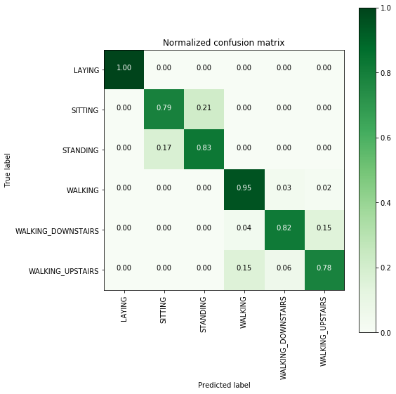


    -------------------------
    | Classifiction Report |
    -------------------------
                        precision    recall  f1-score   support
    
                LAYING       1.00      1.00      1.00       537
               SITTING       0.81      0.79      0.80       491
              STANDING       0.81      0.83      0.82       532
               WALKING       0.84      0.95      0.89       496
    WALKING_DOWNSTAIRS       0.88      0.82      0.85       420
      WALKING_UPSTAIRS       0.84      0.78      0.81       471
    
           avg / total       0.86      0.86      0.86      2947
    
    --------------------------
    |      Best Estimator     |
    --------------------------
    
    	DecisionTreeClassifier(class_weight=None, criterion='gini', max_depth=7,
                max_features=None, max_leaf_nodes=None,
                min_impurity_decrease=0.0, min_impurity_split=None,
                min_samples_leaf=1, min_samples_split=2,
                min_weight_fraction_leaf=0.0, presort=False, random_state=None,
                splitter='best')
    
    --------------------------
    |     Best parameters     |
    --------------------------
    	Parameters of best estimator : 
    
    	{'max_depth': 7}
    
    ---------------------------------
    |   No of CrossValidation sets   |
    --------------------------------
    
    	Total numbre of cross validation sets: 3
    
    --------------------------
    |        Best Score       |
    --------------------------
    
    	Average Cross Validate scores of best estimator : 
    
    	0.8369151251360174
    
    

## 5. Random Forest Classifier with GridSearch


```python
from sklearn.ensemble import RandomForestClassifier
params = {'n_estimators': np.arange(10,201,20), 'max_depth':np.arange(3,15,2)}
rfc = RandomForestClassifier()
rfc_grid = GridSearchCV(rfc, param_grid=params, n_jobs=-1)
rfc_grid_results = perform_model(rfc_grid, X_train, y_train, X_test, y_test, class_labels=labels)
print_grid_search_attributes(rfc_grid_results['model'])
```

    training the model..
    Done 
     
    
    training_time(HH:MM:SS.ms) - 0:06:22.775270
    
    
    Predicting test data
    Done 
     
    
    testing time(HH:MM:SS:ms) - 0:00:00.025937
    
    
    ---------------------
    |      Accuracy      |
    ---------------------
    
        0.9131319986426875
    
    
    --------------------
    | Confusion Matrix |
    --------------------
    
     [[537   0   0   0   0   0]
     [  0 427  64   0   0   0]
     [  0  52 480   0   0   0]
     [  0   0   0 484  10   2]
     [  0   0   0  38 332  50]
     [  0   0   0  34   6 431]]
    


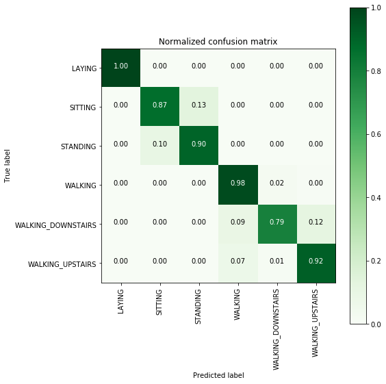


    -------------------------
    | Classifiction Report |
    -------------------------
                        precision    recall  f1-score   support
    
                LAYING       1.00      1.00      1.00       537
               SITTING       0.89      0.87      0.88       491
              STANDING       0.88      0.90      0.89       532
               WALKING       0.87      0.98      0.92       496
    WALKING_DOWNSTAIRS       0.95      0.79      0.86       420
      WALKING_UPSTAIRS       0.89      0.92      0.90       471
    
           avg / total       0.92      0.91      0.91      2947
    
    --------------------------
    |      Best Estimator     |
    --------------------------
    
    	RandomForestClassifier(bootstrap=True, class_weight=None, criterion='gini',
                max_depth=7, max_features='auto', max_leaf_nodes=None,
                min_impurity_decrease=0.0, min_impurity_split=None,
                min_samples_leaf=1, min_samples_split=2,
                min_weight_fraction_leaf=0.0, n_estimators=70, n_jobs=1,
                oob_score=False, random_state=None, verbose=0,
                warm_start=False)
    
    --------------------------
    |     Best parameters     |
    --------------------------
    	Parameters of best estimator : 
    
    	{'max_depth': 7, 'n_estimators': 70}
    
    ---------------------------------
    |   No of CrossValidation sets   |
    --------------------------------
    
    	Total numbre of cross validation sets: 3
    
    --------------------------
    |        Best Score       |
    --------------------------
    
    	Average Cross Validate scores of best estimator : 
    
    	0.9141730141458106
    
    

## 6.  Gradient Boosted Decision Trees With GridSearch


```python
from sklearn.ensemble import GradientBoostingClassifier
param_grid = {'max_depth': np.arange(5,8,1), \
             'n_estimators':np.arange(130,170,10)}
gbdt = GradientBoostingClassifier()
gbdt_grid = GridSearchCV(gbdt, param_grid=param_grid, n_jobs=-1)
gbdt_grid_results = perform_model(gbdt_grid, X_train, y_train, X_test, y_test, class_labels=labels)
print_grid_search_attributes(gbdt_grid_results['model'])
```

    training the model..
    Done 
     
    
    training_time(HH:MM:SS.ms) - 0:28:03.653432
    
    
    Predicting test data
    Done 
     
    
    testing time(HH:MM:SS:ms) - 0:00:00.058843
    
    
    ---------------------
    |      Accuracy      |
    ---------------------
    
        0.9222938581608415
    
    
    --------------------
    | Confusion Matrix |
    --------------------
    
     [[537   0   0   0   0   0]
     [  0 396  93   0   0   2]
     [  0  37 495   0   0   0]
     [  0   0   0 483   7   6]
     [  0   0   0  10 374  36]
     [  0   1   0  31   6 433]]
    


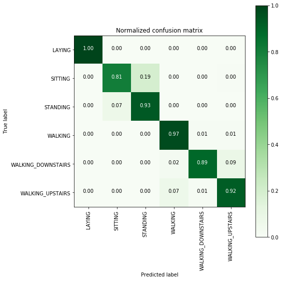


    -------------------------
    | Classifiction Report |
    -------------------------
                        precision    recall  f1-score   support
    
                LAYING       1.00      1.00      1.00       537
               SITTING       0.91      0.81      0.86       491
              STANDING       0.84      0.93      0.88       532
               WALKING       0.92      0.97      0.95       496
    WALKING_DOWNSTAIRS       0.97      0.89      0.93       420
      WALKING_UPSTAIRS       0.91      0.92      0.91       471
    
           avg / total       0.92      0.92      0.92      2947
    
    --------------------------
    |      Best Estimator     |
    --------------------------
    
    	GradientBoostingClassifier(criterion='friedman_mse', init=None,
                  learning_rate=0.1, loss='deviance', max_depth=5,
                  max_features=None, max_leaf_nodes=None,
                  min_impurity_decrease=0.0, min_impurity_split=None,
                  min_samples_leaf=1, min_samples_split=2,
                  min_weight_fraction_leaf=0.0, n_estimators=140,
                  presort='auto', random_state=None, subsample=1.0, verbose=0,
                  warm_start=False)
    
    --------------------------
    |     Best parameters     |
    --------------------------
    	Parameters of best estimator : 
    
    	{'max_depth': 5, 'n_estimators': 140}
    
    ---------------------------------
    |   No of CrossValidation sets   |
    --------------------------------
    
    	Total numbre of cross validation sets: 3
    
    --------------------------
    |        Best Score       |
    --------------------------
    
    	Average Cross Validate scores of best estimator : 
    
    	0.904379760609358
    
    

# Deep Learning Models on raw time series data

## Loading Data


```python
# Activities are the class labels
# It is a 6 class classification
ACTIVITIES = {
    0: 'WALKING',
    1: 'WALKING_UPSTAIRS',
    2: 'WALKING_DOWNSTAIRS',
    3: 'SITTING',
    4: 'STANDING',
    5: 'LAYING'}

# Utility function to print the confusion matrix
def confusion_matrix(Y_true, Y_pred):
    Y_true = pd.Series([ACTIVITIES[y] for y in np.argmax(Y_true, axis=1)])
    Y_pred = pd.Series([ACTIVITIES[y] for y in np.argmax(Y_pred, axis=1)])

    return pd.crosstab(Y_true, Y_pred, rownames=['True'], colnames=['Pred'])
```


```python
DATADIR = 'UCI_HAR_Dataset'
```


```python
# Signals are from Accelerometer and Gyroscope
# The signals are in x,y,z directions
# Sensor signals are filtered to have only body acceleration
# excluding the acceleration due to gravity
# Triaxial acceleration from the accelerometer is total acceleration
SIGNALS = [
    "body_acc_x",
    "body_acc_y",
    "body_acc_z",
    "body_gyro_x",
    "body_gyro_y",
    "body_gyro_z",
    "total_acc_x",
    "total_acc_y",
    "total_acc_z"
]
```


```python
def _read_csv(filename):
    return pd.read_csv(filename, delim_whitespace=True, header=None)

# Utility function to load the load
def load_signals(subset):
    signals_data = []

    for signal in SIGNALS:
        filename = f'UCI_HAR_Dataset/{subset}/Inertial Signals/{signal}_{subset}.txt'
        signals_data.append(
            _read_csv(filename).as_matrix()
        ) 

    # Transpose is used to change the dimensionality of the output,
    # aggregating the signals by combination of sample/timestep.
    # Resultant shape is (7352 train/2947 test samples, 128 timesteps, 9 signals)
    return np.transpose(signals_data, (1, 2, 0))
```


```python
def load_y(subset):
    """
    The objective that we are trying to predict is a integer, from 1 to 6,
    that represents a human activity. We return a binary representation of 
    every sample objective as a 6 bits vector using One Hot Encoding
    (https://pandas.pydata.org/pandas-docs/stable/generated/pandas.get_dummies.html)
    """
    filename = f'UCI_HAR_Dataset/{subset}/y_{subset}.txt'
    y = _read_csv(filename)[0]

    return pd.get_dummies(y).as_matrix()
```


```python
# Importing tensorflow
np.random.seed(42)
import tensorflow as tf
tf.set_random_seed(42)
```


```python
# Configuring a session
session_conf = tf.ConfigProto(
    intra_op_parallelism_threads=1,
    inter_op_parallelism_threads=1
)
```


```python
# Import Keras
from keras import backend as K
sess = tf.Session(graph=tf.get_default_graph(), config=session_conf)
K.set_session(sess)
```

    Using TensorFlow backend.
    


```python
# Importing libraries
from keras.models import Sequential
from keras.layers import LSTM
from keras.layers.core import Dense, Dropout
```


```python
# Utility function to count the number of classes
def _count_classes(y):
    return len(set([tuple(category) for category in y]))
```


```python
# Loading the train and test data
X_train, X_test, Y_train, Y_test = load_data()
```


```python
timesteps = len(X_train[0])
input_dim = len(X_train[0][0])
n_classes = _count_classes(Y_train)

print(timesteps)
print(input_dim)
print(len(X_train))
```

    128
    9
    7352
    

## Single LSTM layer Model


```python
# Initializing parameters
epochs = 30
batch_size = 32
```

### Defining architecture


```python
# Initiliazing the sequential model
model = Sequential()
# Configuring the parameters
model.add(LSTM(32, input_shape=(timesteps, input_dim)))
# Adding a dropout layer
model.add(Dropout(0.5))
# Adding a dense output layer with sigmoid activation
model.add(Dense(n_classes, activation='sigmoid'))
model.summary()
```

    _________________________________________________________________
    Layer (type)                 Output Shape              Param #   
    =================================================================
    lstm_3 (LSTM)                (None, 32)                5376      
    _________________________________________________________________
    dropout_3 (Dropout)          (None, 32)                0         
    _________________________________________________________________
    dense_3 (Dense)              (None, 6)                 198       
    =================================================================
    Total params: 5,574
    Trainable params: 5,574
    Non-trainable params: 0
    _________________________________________________________________
    


```python
# Compiling the model
model.compile(loss='categorical_crossentropy',
              optimizer='rmsprop',
              metrics=['accuracy'])
```

### Training 


```python
# Training the model
model.fit(X_train,
          Y_train,
          batch_size=batch_size,
          validation_data=(X_test, Y_test),
          epochs=epochs)
```

    Train on 7352 samples, validate on 2947 samples
    Epoch 1/30
    7352/7352 [==============================] - 92s 13ms/step - loss: 1.3018 - acc: 0.4395 - val_loss: 1.1254 - val_acc: 0.4662
    Epoch 2/30
    7352/7352 [==============================] - 94s 13ms/step - loss: 0.9666 - acc: 0.5880 - val_loss: 0.9491 - val_acc: 0.5714
    Epoch 3/30
    7352/7352 [==============================] - 97s 13ms/step - loss: 0.7812 - acc: 0.6408 - val_loss: 0.8286 - val_acc: 0.5850
    Epoch 4/30
    7352/7352 [==============================] - 95s 13ms/step - loss: 0.6941 - acc: 0.6574 - val_loss: 0.7297 - val_acc: 0.6128
    Epoch 5/30
    7352/7352 [==============================] - 92s 13ms/step - loss: 0.6336 - acc: 0.6912 - val_loss: 0.7359 - val_acc: 0.6787
    Epoch 6/30
    7352/7352 [==============================] - 94s 13ms/step - loss: 0.5859 - acc: 0.7134 - val_loss: 0.7015 - val_acc: 0.6939
    Epoch 7/30
    7352/7352 [==============================] - 95s 13ms/step - loss: 0.5692 - acc: 0.7477 - val_loss: 0.5995 - val_acc: 0.7387
    Epoch 8/30
    7352/7352 [==============================] - 96s 13ms/step - loss: 0.4899 - acc: 0.7809 - val_loss: 0.5762 - val_acc: 0.7387
    Epoch 9/30
    7352/7352 [==============================] - 90s 12ms/step - loss: 0.4482 - acc: 0.7886 - val_loss: 0.7413 - val_acc: 0.7126
    Epoch 10/30
    7352/7352 [==============================] - 90s 12ms/step - loss: 0.4132 - acc: 0.8077 - val_loss: 0.5048 - val_acc: 0.7513
    Epoch 11/30
    7352/7352 [==============================] - 89s 12ms/step - loss: 0.3985 - acc: 0.8274 - val_loss: 0.5234 - val_acc: 0.7452
    Epoch 12/30
    7352/7352 [==============================] - 91s 12ms/step - loss: 0.3378 - acc: 0.8638 - val_loss: 0.4114 - val_acc: 0.8833
    Epoch 13/30
    7352/7352 [==============================] - 91s 12ms/step - loss: 0.2947 - acc: 0.9051 - val_loss: 0.4386 - val_acc: 0.8731
    Epoch 14/30
    7352/7352 [==============================] - 90s 12ms/step - loss: 0.2448 - acc: 0.9291 - val_loss: 0.3768 - val_acc: 0.8921
    Epoch 15/30
    7352/7352 [==============================] - 91s 12ms/step - loss: 0.2157 - acc: 0.9331 - val_loss: 0.4441 - val_acc: 0.8931
    Epoch 16/30
    7352/7352 [==============================] - 90s 12ms/step - loss: 0.2053 - acc: 0.9366 - val_loss: 0.4162 - val_acc: 0.8968
    Epoch 17/30
    7352/7352 [==============================] - 89s 12ms/step - loss: 0.2028 - acc: 0.9404 - val_loss: 0.4538 - val_acc: 0.8962
    Epoch 18/30
    7352/7352 [==============================] - 93s 13ms/step - loss: 0.1911 - acc: 0.9419 - val_loss: 0.3964 - val_acc: 0.8999
    Epoch 19/30
    7352/7352 [==============================] - 96s 13ms/step - loss: 0.1912 - acc: 0.9407 - val_loss: 0.3165 - val_acc: 0.9030
    Epoch 20/30
    7352/7352 [==============================] - 96s 13ms/step - loss: 0.1732 - acc: 0.9446 - val_loss: 0.4546 - val_acc: 0.8904
    Epoch 21/30
    7352/7352 [==============================] - 94s 13ms/step - loss: 0.1782 - acc: 0.9444 - val_loss: 0.3346 - val_acc: 0.9063
    Epoch 22/30
    7352/7352 [==============================] - 95s 13ms/step - loss: 0.1812 - acc: 0.9418 - val_loss: 0.8164 - val_acc: 0.8582
    Epoch 23/30
    7352/7352 [==============================] - 95s 13ms/step - loss: 0.1824 - acc: 0.9426 - val_loss: 0.4240 - val_acc: 0.9036
    Epoch 24/30
    7352/7352 [==============================] - 94s 13ms/step - loss: 0.1726 - acc: 0.9429 - val_loss: 0.4067 - val_acc: 0.9148
    Epoch 25/30
    7352/7352 [==============================] - 96s 13ms/step - loss: 0.1737 - acc: 0.9411 - val_loss: 0.3396 - val_acc: 0.9074
    Epoch 26/30
    7352/7352 [==============================] - 96s 13ms/step - loss: 0.1650 - acc: 0.9461 - val_loss: 0.3806 - val_acc: 0.9019
    Epoch 27/30
    7352/7352 [==============================] - 89s 12ms/step - loss: 0.1925 - acc: 0.9415 - val_loss: 0.6464 - val_acc: 0.8850
    Epoch 28/30
    7352/7352 [==============================] - 91s 12ms/step - loss: 0.1965 - acc: 0.9425 - val_loss: 0.3363 - val_acc: 0.9203
    Epoch 29/30
    7352/7352 [==============================] - 92s 12ms/step - loss: 0.1889 - acc: 0.9431 - val_loss: 0.3737 - val_acc: 0.9158
    Epoch 30/30
    7352/7352 [==============================] - 95s 13ms/step - loss: 0.1945 - acc: 0.9414 - val_loss: 0.3088 - val_acc: 0.9097
    


    <keras.callbacks.History at 0x29b5ee36a20>


### Test performance and other metrics


```python
# Confusion Matriax
print(confusion_matrix(Y_test, model.predict(X_test)))
```

    Pred                LAYING  SITTING  STANDING  WALKING  WALKING_DOWNSTAIRS  \
    True                                                                         
    LAYING                 512        0        25        0                   0   
    SITTING                  3      410        75        0                   0   
    STANDING                 0       87       445        0                   0   
    WALKING                  0        0         0      481                   2   
    WALKING_DOWNSTAIRS       0        0         0        0                 382   
    WALKING_UPSTAIRS         0        0         0        2                  18   
    
    Pred                WALKING_UPSTAIRS  
    True                                  
    LAYING                             0  
    SITTING                            3  
    STANDING                           0  
    WALKING                           13  
    WALKING_DOWNSTAIRS                38  
    WALKING_UPSTAIRS                 451  
    


```python
score = model.evaluate(X_test, Y_test)
```

    2947/2947 [==============================] - 4s 2ms/step
    


```python
score
```


    [0.3087582236972612, 0.9097387173396675]


## Two LSTM layers Model

### Defining architecture


```python
# Initiliazing the sequential model
model = Sequential()
# Configuring the parameters
model.add(LSTM(32, input_shape=(timesteps, input_dim), dropout=0.25,return_sequences=True))
model.add(LSTM(16, dropout=0.25))
# Adding a dense output layer with sigmoid activation
model.add(Dense(n_classes, activation='sigmoid'))
model.summary()
```

    _________________________________________________________________
    Layer (type)                 Output Shape              Param #   
    =================================================================
    lstm_5 (LSTM)                (None, 128, 32)           5376      
    _________________________________________________________________
    lstm_6 (LSTM)                (None, 16)                3136      
    _________________________________________________________________
    dense_5 (Dense)              (None, 6)                 102       
    =================================================================
    Total params: 8,614
    Trainable params: 8,614
    Non-trainable params: 0
    _________________________________________________________________
    


```python
# Compiling the model
model.compile(loss='categorical_crossentropy',
              optimizer='rmsprop',
              metrics=['accuracy'])
```

### Training 


```python
# Training the model
history=model.fit(X_train,
          Y_train,
          batch_size=batch_size,
          validation_data=(X_test, Y_test),
          epochs=epochs)
```

    Train on 7352 samples, validate on 2947 samples
    Epoch 1/30
    7352/7352 [==============================] - 146s 20ms/step - loss: 1.4275 - acc: 0.4361 - val_loss: 1.1241 - val_acc: 0.5823
    Epoch 2/30
    7352/7352 [==============================] - 146s 20ms/step - loss: 1.0763 - acc: 0.5366 - val_loss: 1.0793 - val_acc: 0.5497
    Epoch 3/30
    7352/7352 [==============================] - 144s 20ms/step - loss: 0.9250 - acc: 0.5691 - val_loss: 0.8403 - val_acc: 0.5996
    Epoch 4/30
    7352/7352 [==============================] - 145s 20ms/step - loss: 0.8332 - acc: 0.5929 - val_loss: 0.7952 - val_acc: 0.6003
    Epoch 5/30
    7352/7352 [==============================] - 144s 20ms/step - loss: 0.7625 - acc: 0.6258 - val_loss: 0.7607 - val_acc: 0.6043
    Epoch 6/30
    7352/7352 [==============================] - 143s 19ms/step - loss: 0.7345 - acc: 0.6298 - val_loss: 0.7082 - val_acc: 0.6132
    Epoch 7/30
    7352/7352 [==============================] - 144s 20ms/step - loss: 0.7106 - acc: 0.6378 - val_loss: 0.7439 - val_acc: 0.6030
    Epoch 8/30
    7352/7352 [==============================] - 143s 19ms/step - loss: 0.6875 - acc: 0.6589 - val_loss: 0.6600 - val_acc: 0.7316
    Epoch 9/30
    7352/7352 [==============================] - 144s 20ms/step - loss: 0.6543 - acc: 0.6993 - val_loss: 0.6591 - val_acc: 0.7234
    Epoch 10/30
    7352/7352 [==============================] - 143s 20ms/step - loss: 0.6354 - acc: 0.7247 - val_loss: 0.6396 - val_acc: 0.7455
    Epoch 11/30
    7352/7352 [==============================] - 145s 20ms/step - loss: 0.5989 - acc: 0.7586 - val_loss: 0.6150 - val_acc: 0.7737
    Epoch 12/30
    7352/7352 [==============================] - 142s 19ms/step - loss: 0.5532 - acc: 0.7899 - val_loss: 0.4416 - val_acc: 0.8809
    Epoch 13/30
    7352/7352 [==============================] - 144s 20ms/step - loss: 0.4853 - acc: 0.8270 - val_loss: 0.3716 - val_acc: 0.9016
    Epoch 14/30
    7352/7352 [==============================] - 144s 20ms/step - loss: 0.4087 - acc: 0.8625 - val_loss: 0.3110 - val_acc: 0.9036
    Epoch 15/30
    7352/7352 [==============================] - 146s 20ms/step - loss: 0.3577 - acc: 0.8785 - val_loss: 0.2815 - val_acc: 0.9118
    Epoch 16/30
    7352/7352 [==============================] - 145s 20ms/step - loss: 0.3258 - acc: 0.8890 - val_loss: 0.3977 - val_acc: 0.8751
    Epoch 17/30
    7352/7352 [==============================] - 147s 20ms/step - loss: 0.3015 - acc: 0.8965 - val_loss: 0.2725 - val_acc: 0.9002
    Epoch 18/30
    7352/7352 [==============================] - 146s 20ms/step - loss: 0.2836 - acc: 0.8998 - val_loss: 0.2884 - val_acc: 0.9013
    Epoch 19/30
    7352/7352 [==============================] - 145s 20ms/step - loss: 0.2646 - acc: 0.9067 - val_loss: 0.2618 - val_acc: 0.9006
    Epoch 20/30
    7352/7352 [==============================] - 144s 20ms/step - loss: 0.2598 - acc: 0.9021 - val_loss: 0.2599 - val_acc: 0.9026
    Epoch 21/30
    7352/7352 [==============================] - 142s 19ms/step - loss: 0.2407 - acc: 0.9094 - val_loss: 0.2712 - val_acc: 0.9084
    Epoch 22/30
    7352/7352 [==============================] - 143s 19ms/step - loss: 0.2264 - acc: 0.9173 - val_loss: 0.2593 - val_acc: 0.9121
    Epoch 23/30
    7352/7352 [==============================] - 142s 19ms/step - loss: 0.2235 - acc: 0.9161 - val_loss: 0.2382 - val_acc: 0.9213
    Epoch 24/30
    7352/7352 [==============================] - 143s 20ms/step - loss: 0.2258 - acc: 0.9159 - val_loss: 0.2534 - val_acc: 0.9175
    Epoch 25/30
    7352/7352 [==============================] - 142s 19ms/step - loss: 0.2097 - acc: 0.9189 - val_loss: 0.2330 - val_acc: 0.9172
    Epoch 26/30
    7352/7352 [==============================] - 144s 20ms/step - loss: 0.2221 - acc: 0.9196 - val_loss: 0.2529 - val_acc: 0.9155
    Epoch 27/30
    7352/7352 [==============================] - 144s 20ms/step - loss: 0.2202 - acc: 0.9210 - val_loss: 0.2821 - val_acc: 0.9063
    Epoch 28/30
    7352/7352 [==============================] - 144s 20ms/step - loss: 0.1960 - acc: 0.9237 - val_loss: 0.2502 - val_acc: 0.9131
    Epoch 29/30
    7352/7352 [==============================] - 141s 19ms/step - loss: 0.1935 - acc: 0.9285 - val_loss: 0.2334 - val_acc: 0.9182
    Epoch 30/30
    7352/7352 [==============================] - 143s 19ms/step - loss: 0.1984 - acc: 0.9246 - val_loss: 0.2639 - val_acc: 0.9172
    

### Test performance and other metrics


```python
# Confusion Matrix
print(confusion_matrix(Y_test, model.predict(X_test)))
```

    Pred                LAYING  SITTING  STANDING  WALKING  WALKING_DOWNSTAIRS  \
    True                                                                         
    LAYING                 536        0         0        1                   0   
    SITTING                  6      370       110        1                   2   
    STANDING                 0       65       459        6                   0   
    WALKING                  0        0         0      461                  34   
    WALKING_DOWNSTAIRS       0        0         0        0                 419   
    WALKING_UPSTAIRS         0        0         0       10                   3   
    
    Pred                WALKING_UPSTAIRS  
    True                                  
    LAYING                             0  
    SITTING                            2  
    STANDING                           2  
    WALKING                            1  
    WALKING_DOWNSTAIRS                 1  
    WALKING_UPSTAIRS                 458  
    


```python
score = model.evaluate(X_test, Y_test)
```

    2947/2947 [==============================] - 15s 5ms/step
    


```python
score
```


    [0.2638513519234948, 0.9172039362063115]


# Comparing all models and conclusion

## Classical ML Models on expert generated features


```python
print('\n                     Accuracy     Error')
print('                     ----------   --------')
print('Logistic Regression : {:.04}%       {:.04}%'.format(log_reg_grid_results['accuracy'] * 100,\
                                                  100-(log_reg_grid_results['accuracy'] * 100)))

print('Linear SVC          : {:.04}%       {:.04}% '.format(lr_svc_grid_results['accuracy'] * 100,\
                                                        100-(lr_svc_grid_results['accuracy'] * 100)))

print('rbf SVM classifier  : {:.04}%      {:.04}% '.format(rbf_svm_grid_results['accuracy'] * 100,\
                                                          100-(rbf_svm_grid_results['accuracy'] * 100)))

print('DecisionTree        : {:.04}%      {:.04}% '.format(dt_grid_results['accuracy'] * 100,\
                                                        100-(dt_grid_results['accuracy'] * 100)))

print('Random Forest       : {:.04}%      {:.04}% '.format(rfc_grid_results['accuracy'] * 100,\
                                                           100-(rfc_grid_results['accuracy'] * 100)))
print('GradientBoosting DT : {:.04}%      {:.04}% '.format(rfc_grid_results['accuracy'] * 100,\
                                                        100-(rfc_grid_results['accuracy'] * 100)))
```

    
                         Accuracy     Error
                         ----------   --------
    Logistic Regression : 96.27%       3.733%
    Linear SVC          : 96.61%       3.393% 
    rbf SVM classifier  : 96.27%      3.733% 
    DecisionTree        : 86.43%      13.57% 
    Random Forest       : 91.31%      8.687% 
    GradientBoosting DT : 91.31%      8.687% 
    

### Conclusion :

Our linear models are achieving 96%+ accuracy . This shows that in the real world, domain-knowledge, EDA and feature-engineering matter most. We can choose ___Logistic regression___ or ___Linear SVC___ or ___rbf SVM___.  Tree based methods do not perform as well.

## LSTM Models on raw time series data

| No. of LSTM layers |Train loss | Test loss | Test accuracy(%) |
|-|
| 1 | 0.1945 | 0.3088 | 90.97 | 
| 2 | 0.1984 | 0.2638 | 91.72 |

### Conclusion :

Even with small amount  of data ,the simple LSTM Models on raw data are not performing much worse than Classical ML models on expert generated features. With more data , we could have matched ML Models' performance with LSTMs . This shows while there is no substitute of feature engineering using domain knowledge, Deep Learning models can come pretty close without any feature engineering only if we have enough data.
