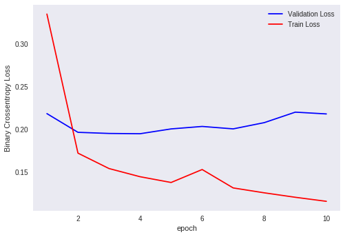
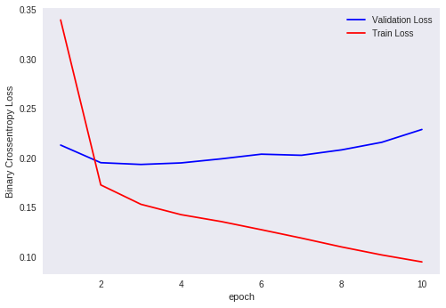

<h1>Table of Contents<span class="tocSkip"></span></h1>
<div class="toc"><ul class="toc-item"><li><span><a href="#Conclusion" data-toc-modified-id="Conclusion-1">Conclusion</a></span></li></ul></div>


```python
# Credits: https://machinelearningmastery.com/sequence-classification-lstm-recurrent-neural-networks-python-keras/
# LSTM for sequence classification in the IMDB dataset
import numpy as np
from keras.models import Sequential
from keras.layers import Dense
from keras.layers import LSTM
from keras.layers.embeddings import Embedding
from keras.preprocessing import sequence
import matplotlib.pyplot as plt
import seaborn as sns
# fix random seed for reproducibility
np.random.seed(7)

```

    Using TensorFlow backend.
    

**The below cell ran on local system and includes the Text to index sequence conversion**


```python
# Rtrain = final['CleanedText'][:int(final['CleanedText'].shape[0] * .80)]
# Rtest = final['CleanedText'][int(final['CleanedText'].shape[0] * .80):]
# y_train = final['Score'][:int(final['Score'].shape[0] * .80)]
# y_test = final['Score'][int(final['Score'].shape[0] * .80):]

### Converting text to sequences of word ranks

#from keras.preprocessing.text import Tokenize

# indexer = Tokenizer(num_words=20000)
# indexer.fit_on_texts(Rtrain.values)
# train_seq= indexer.texts_to_sequences(Rtrain.values)
# test_seq= indexer.texts_to_sequences(Rtest.values)

### Checking what should be maximum length for padding

# siz=[]
# for i in range(Rtrain.shape[0]):
#     so=np.shape(train_seq[i])[0]
#     siz.append(so)
# np.percentile(siz,99.9)

### output = 369


# max_review_length = 400
# X_train = sequence.pad_sequences(train_seq, maxlen=max_review_length)
# X_test = sequence.pad_sequences(test_seq, maxlen=max_review_length)

# print(X_train.shape)
# print(X_train[1])

# np.savez_compressed('datas', a=X_train, b=X_test,c=y_train,d=y_test)
```


```python
# truncate and/or pad input sequences
max_review_length = 400
top_words=20000
```


```python
from google.colab import files

uploaded = files.upload()
for fn in uploaded.keys():
  print('User uploaded file "{name}" with length {length} bytes'.format(
      name=fn, length=len(uploaded[fn])))
```


     <input type="file" id="files-ac161f14-d55e-427d-ada5-7ec085007d17" name="files[]" multiple disabled />
     <output id="result-ac161f14-d55e-427d-ada5-7ec085007d17">
      Upload widget is only available when the cell has been executed in the
      current browser session. Please rerun this cell to enable.
      </output>
      <script src="/nbextensions/google.colab/files.js"></script> 


    Saving datas.npz to datas.npz
    User uploaded file "datas.npz" with length 33127402 bytes
    


```python
loaded = np.load('datas.npz')
X_train=loaded['a']
X_test=loaded['b']
Y_train=loaded['c']
Y_test=loaded['d']
```


```python
x_train = X_train[:int(X_train.shape[0]*0.8)]
x_val = X_train[int(X_train.shape[0]*0.8):]
y_train = Y_train[:int(X_train.shape[0]*0.8)]
y_val = Y_train[int(X_train.shape[0]*0.8):]
```


```python
# create the model
embedding_vecor_length = 32
model = Sequential()
model.add(Embedding(top_words, embedding_vecor_length, input_length=max_review_length))
model.add(LSTM(100))
model.add(Dense(1, activation='sigmoid'))
model.compile(loss='binary_crossentropy', optimizer='adam', metrics=['accuracy'])
print(model.summary())
```

    _________________________________________________________________
    Layer (type)                 Output Shape              Param #   
    =================================================================
    embedding_1 (Embedding)      (None, 400, 32)           640000    
    _________________________________________________________________
    lstm_1 (LSTM)                (None, 100)               53200     
    _________________________________________________________________
    dense_1 (Dense)              (None, 1)                 101       
    =================================================================
    Total params: 693,301
    Trainable params: 693,301
    Non-trainable params: 0
    _________________________________________________________________
    None
    


```python
history=model.fit(x_train, y_train, epochs=10, batch_size=2048,validation_data=(x_val, y_val))
# Final evaluation of the model
scores = model.evaluate(X_test, y_test, verbose=0)
print('Test loss:', scores[0])
print("Accuracy: %.2f%%" % (scores[1]*100))
```

    Train on 233068 samples, validate on 58268 samples
    Epoch 1/10
    233068/233068 [==============================] - 156s 668us/step - loss: 0.3348 - acc: 0.8759 - val_loss: 0.2185 - val_acc: 0.9130
    Epoch 2/10
    233068/233068 [==============================] - 152s 654us/step - loss: 0.1723 - acc: 0.9327 - val_loss: 0.1966 - val_acc: 0.9220
    Epoch 3/10
    233068/233068 [==============================] - 153s 655us/step - loss: 0.1543 - acc: 0.9413 - val_loss: 0.1953 - val_acc: 0.9241
    Epoch 4/10
    233068/233068 [==============================] - 153s 655us/step - loss: 0.1448 - acc: 0.9452 - val_loss: 0.1950 - val_acc: 0.9239
    Epoch 5/10
    233068/233068 [==============================] - 152s 654us/step - loss: 0.1380 - acc: 0.9483 - val_loss: 0.2006 - val_acc: 0.9228
    Epoch 6/10
    233068/233068 [==============================] - 152s 654us/step - loss: 0.1531 - acc: 0.9422 - val_loss: 0.2035 - val_acc: 0.9227
    Epoch 7/10
    233068/233068 [==============================] - 152s 654us/step - loss: 0.1317 - acc: 0.9507 - val_loss: 0.2007 - val_acc: 0.9216
    Epoch 8/10
    233068/233068 [==============================] - 153s 656us/step - loss: 0.1259 - acc: 0.9533 - val_loss: 0.2079 - val_acc: 0.9216
    Epoch 9/10
    233068/233068 [==============================] - 152s 653us/step - loss: 0.1207 - acc: 0.9563 - val_loss: 0.2202 - val_acc: 0.9215
    Epoch 10/10
    233068/233068 [==============================] - 153s 655us/step - loss: 0.1160 - acc: 0.9584 - val_loss: 0.2181 - val_acc: 0.9213
    Test loss: 0.22145987137233522
    Accuracy: 92.11%
    


```python
def plt_dynamic(x, vy, ty, ax, colors=['b']):
    ax.plot(x, vy, 'b', label="Validation Loss")
    ax.plot(x, ty, 'r', label="Train Loss")
    plt.legend()
    plt.grid()
    fig.canvas.draw()
```


```python
epochs=10
fig,ax = plt.subplots(1,1)
ax.set_xlabel('epoch') ; ax.set_ylabel('Binary Crossentropy Loss')
x = list(range(1,epochs+1))
vy = history.history['val_loss']
ty = history.history['loss']
plt_dynamic(x, vy, ty, ax)
```





```python
model = Sequential()
model.add(Embedding(top_words, embedding_vecor_length, input_length=max_review_length))
model.add(LSTM(100,return_sequences=True))
model.add(LSTM(32))
model.add(Dense(1, activation='sigmoid'))
model.compile(loss='binary_crossentropy', optimizer='adam', metrics=['accuracy'])
print(model.summary())
```

    _________________________________________________________________
    Layer (type)                 Output Shape              Param #   
    =================================================================
    embedding_2 (Embedding)      (None, 400, 32)           640000    
    _________________________________________________________________
    lstm_2 (LSTM)                (None, 400, 100)          53200     
    _________________________________________________________________
    lstm_3 (LSTM)                (None, 32)                17024     
    _________________________________________________________________
    dense_2 (Dense)              (None, 1)                 33        
    =================================================================
    Total params: 710,257
    Trainable params: 710,257
    Non-trainable params: 0
    _________________________________________________________________
    None
    


```python
history=model.fit(x_train, y_train, epochs=10, batch_size=2048,validation_data=(x_val, y_val))
# Final evaluation of the model
scores = model.evaluate(X_test, y_test, verbose=0)
print('Test loss:', scores[0])
print("Accuracy: %.2f%%" % (scores[1]*100))

```

    Train on 233068 samples, validate on 58268 samples
    Epoch 1/10
    233068/233068 [==============================] - 290s 1ms/step - loss: 0.3395 - acc: 0.8801 - val_loss: 0.2128 - val_acc: 0.9162
    Epoch 2/10
    233068/233068 [==============================] - 287s 1ms/step - loss: 0.1725 - acc: 0.9340 - val_loss: 0.1950 - val_acc: 0.9234
    Epoch 3/10
    233068/233068 [==============================] - 286s 1ms/step - loss: 0.1529 - acc: 0.9422 - val_loss: 0.1932 - val_acc: 0.9237
    Epoch 4/10
    233068/233068 [==============================] - 284s 1ms/step - loss: 0.1424 - acc: 0.9466 - val_loss: 0.1948 - val_acc: 0.9231
    Epoch 5/10
    233068/233068 [==============================] - 285s 1ms/step - loss: 0.1354 - acc: 0.9493 - val_loss: 0.1989 - val_acc: 0.9245
    Epoch 6/10
    233068/233068 [==============================] - 286s 1ms/step - loss: 0.1272 - acc: 0.9530 - val_loss: 0.2036 - val_acc: 0.9231
    Epoch 7/10
    233068/233068 [==============================] - 286s 1ms/step - loss: 0.1187 - acc: 0.9565 - val_loss: 0.2025 - val_acc: 0.9235
    Epoch 8/10
    233068/233068 [==============================] - 286s 1ms/step - loss: 0.1097 - acc: 0.9605 - val_loss: 0.2080 - val_acc: 0.9246
    Epoch 9/10
    233068/233068 [==============================] - 287s 1ms/step - loss: 0.1016 - acc: 0.9636 - val_loss: 0.2156 - val_acc: 0.9214
    Epoch 10/10
    233068/233068 [==============================] - 285s 1ms/step - loss: 0.0946 - acc: 0.9666 - val_loss: 0.2286 - val_acc: 0.9198
    Test loss: 0.2301644423009351
    Accuracy: 92.00%
    


```python
fig,ax = plt.subplots(1,1)
ax.set_xlabel('epoch') ; ax.set_ylabel('Binary Crossentropy Loss')
x = list(range(1,epochs+1))
vy = history.history['val_loss']
ty = history.history['loss']
plt_dynamic(x, vy, ty, ax)
```





# Conclusion

Comparison between models :

| No. of LSTM layers |Train loss | Val loss | Test loss | Test accuracy(%) |
|-|
| 1 | 0.1160 | 0.2181 | 0.2214 | 92.11 |
| 2 | 0.0946 | 0.2286 | 0.2301 | 92.00 |
